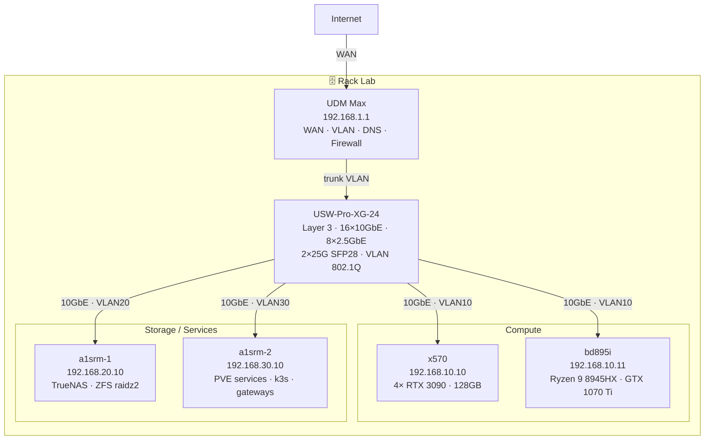
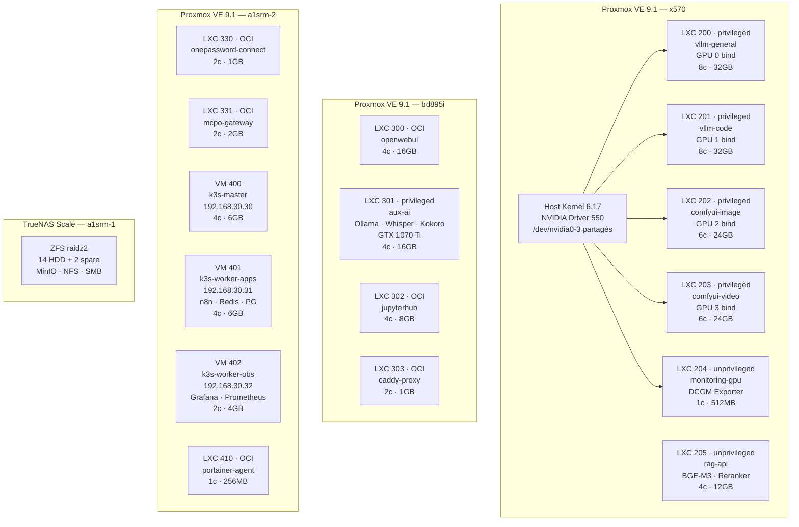
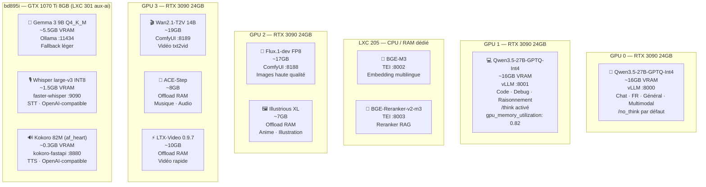
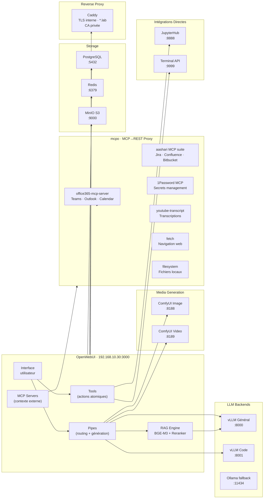
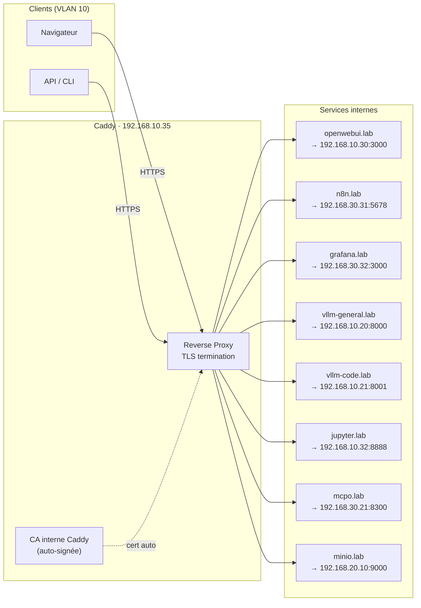
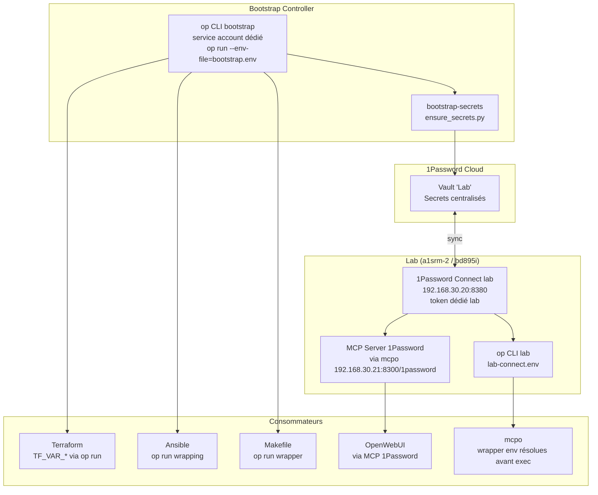

# 🗂️ Dossier Technique — AI Lab Privé

## 1. Hardware

### 1.1 Inventaire complet

#### Nœud Compute Principal — `x570` (192.168.10.10)

| Composant | Détail |
| :-- | :-- |
| **Carte mère** | MSI X570 Godlike |
| **CPU** | AMD Ryzen 9 5950X — 16c/32t — 3.4/4.9GHz |
| **RAM** | 128 GB DDR4-3200MHz (4× G.Skill Ripjaws 32GB) — non-ECC |
| **Stockage** | 2× NVMe (OS + swap ZFS) |
| **GPU** | 4× NVIDIA RTX 3090 24GB GDDR6X — 96GB VRAM total |
| **Réseau** | 2.5GbE intégré → 10GbE via USW-Pro-XG-24 |
| **PCIe** | 4× slots x16/x8 — IOMMU AMD-Vi natif |
| **Alimentation** | 2000W (4×350W GPU + CPU + système, 80% charge max) |

#### Nœud Frontend / Multimédia — `bd895i` (192.168.10.11)

| Composant | Détail |
| :-- | :-- |
| **Carte mère** | Minisforum BD895i SE |
| **CPU** | AMD Ryzen 9 8945HX — 16C/32T (Zen 4) |
| **RAM** | 32 GB DDR5-5200MHz (2× 16GB SODIMM) |
| **Stockage** | 2× 1To M.2 2280 PCIe 4.0 ×4 NVMe |
| **PCIe** | 1× PCIe 5.0 ×16 (pour GPU) |
| **GPU** | NVIDIA GTX 1070 Ti — 8GB GDDR5 (via PCIe 5.0 x16) |
| **Alimentation** | 850W |
| **Rôle** | Frontend OpenWebUI, Whisper STT, Kokoro TTS, Ollama fallback |

#### Nœuds Services — `a1srm-1` / `a1srm-2` (192.168.20/30.10)

| Composant | Détail |
| :-- | :-- |
| **Carte mère** | Supermicro A1SRM-C2759 × 2 |
| **CPU** | Intel Atom C2759 — 8c — 2.4GHz |
| **RAM** | 16 GB DDR3 ECC chacun |
| **Stockage** | 256 GB SSD (OS) |
| **Alimentation** | 500W chacun |
| **Spécifique \#1** | LSI SAS2008 4i+4e → JBOD 16× HDD 3.5" |
| **Rôle \#1** | NAS TrueNAS Scale — ZFS raidz2 |
| **Rôle \#2** | Hyperviseur services — Proxmox + LXCs infra + VMs k3s |

#### Réseau — UniFi

| Équipement | Modèle | Rôle |
| :-- | :-- | :-- |
| **UDM Max** | Ubiquiti UDM Max | Routeur, Firewall, VLAN routing, DNS interne |
| **Switch principal** | USW-Pro-XG-24 | 16× 10GbE RJ45 + 8× 2.5GbE + 2× 25G SFP28 — Layer 3, VLAN tagging 802.1Q |

***

### 1.2 Schéma câblage physique



***

## 2. Réseau

### 2.1 Plan d'adressage

| VLAN | Réseau | Usage | Machines |
| :-- | :-- | :-- | :-- |
| **VLAN 10** | 192.168.10.0/24 | AI Compute + Frontend | x570, bd895i, LXC GPU |
| **VLAN 20** | 192.168.20.0/24 | Storage | a1srm-1, TrueNAS |
| **VLAN 30** | 192.168.30.0/24 | Services | a1srm-2, k3s, n8n |
| **VLAN 1** | 192.168.1.0/24 | Management | UDM, IPMI/BMC |

### 2.2 DNS interne (UDM Max)

#### Noms d'infrastructure / backends

```
x570.lab                  → 192.168.10.10
bd895i.lab                → 192.168.10.11
nas.lab                   → 192.168.20.10
a1srm-2.lab               → 192.168.30.10
vllm-general.int.lab      → 192.168.10.20  (LXC 200)
vllm-code.int.lab         → 192.168.10.21  (LXC 201)
comfyui-image.int.lab     → 192.168.10.22  (LXC 202)
comfyui-video.int.lab     → 192.168.10.23  (LXC 203)
rag.int.lab               → 192.168.10.24  (LXC 205)
openwebui.int.lab         → 192.168.10.30  (LXC 300)
aux-ai.int.lab            → 192.168.10.31  (LXC 301)
jupyter.int.lab           → 192.168.10.32  (LXC 302)
caddy.lab                 → 192.168.10.35  (LXC 303)
onepassword-connect.int.lab → 192.168.30.20  (LXC 330)
monitoring-gpu.int.lab    → 192.168.10.25  (LXC 204)
mcpo.int.lab              → 192.168.30.21  (LXC 331)
k3s-master.lab            → 192.168.30.30  (VM 400)
k3s-apps.lab              → 192.168.30.31  (VM 401)
k3s-obs.lab               → 192.168.30.32  (VM 402)
minio.int.lab             → 192.168.20.10
```

#### Entry points utilisateurs via Caddy

```
openwebui.lab     → 192.168.10.35
jupyter.lab       → 192.168.10.35
n8n.lab           → 192.168.10.35
grafana.lab       → 192.168.10.35
vllm-general.lab  → 192.168.10.35
vllm-code.lab     → 192.168.10.35
comfyui-image.lab → 192.168.10.35
comfyui-video.lab → 192.168.10.35
mcpo.lab          → 192.168.10.35
minio.lab         → 192.168.10.35
```

### 2.3 Firewall rules (UDM Max)

```
VLAN10 → VLAN20 : autoriser TCP 2049 (NFS), 9000-9001 (MinIO)
VLAN10 → VLAN30 : autoriser TCP 5432 (PG), 6379 (Redis)
VLAN30 → VLAN10 : autoriser TCP 8000-8189 (AI APIs)
VLAN30 → Internet : autoriser HTTPS (APIs externes M365, Atlassian)
VLAN10 → Internet : bloquer (sécurité modèles)
WAN → VLAN10 : bloquer tout
Management → ALL : autoriser (administration)

# Sécurisation ComfyUI (Option A — couche firewall UDM)
# Seul OpenWebUI (LXC 300) peut initier des connexions vers ComfyUI sur leurs ports natifs.
# Les admins passent par Caddy (comfyui-image.lab / comfyui-video.lab) avec IP allowlist.
192.168.10.30 → 192.168.10.22:8188 : autoriser (OpenWebUI → ComfyUI image)
192.168.10.30 → 192.168.10.23:8189 : autoriser (OpenWebUI → ComfyUI vidéo)
VLAN10 autres LXC → 192.168.10.22:8188, 192.168.10.23:8189 : BLOQUER
VLAN1 (Management) → 192.168.10.22:8188, 192.168.10.23:8189 : autoriser (accès admin direct)
```

### 2.4 Provisioning réseau physique et bootstrap

| Élément | Décision retenue |
| :-- | :-- |
| **Source d'autorité réseau physique** | UniFi Network (UDM Max + USW-Pro-XG-24) |
| **Automatisation write-path** | Ansible + collection/controller-local API UniFi |
| **API officielle `developer.ui.com`** | Utilisable pour inventaire / lecture, **pas comme base unique du write-path** |
| **Bootstrap initial** | Manuel ou semi-manuel pour adoption controller, profils critiques et premier trunk |
| **Provisioning bare metal** | iPXE + HTTP(S) + `answer.toml` Proxmox |
| **DHCP provisioning** | `dnsmasq` ou `Kea` sur le bootstrap controller |
| **TLS des answer files** | Caddy + pinning SHA256 du certificat |

> **Obtenir le fingerprint réel pour `cert-fingerprint`** :
> Le cert Caddy doit être généré **avant** la préparation de l'ISO, puis le fingerprint
> extrait et injecté dans chaque `answer.toml`. Utiliser un cert à longue durée de vie
> (2–10 ans) pour le bootstrap controller — toute rotation invalide les ISOs générées.
>
> ```bash
> # Sur le bootstrap controller, une fois Caddy démarré
> # Option 1 — depuis le socket TLS live
> openssl s_client -connect bootstrap.lab:443 </dev/null 2>/dev/null \
>   | openssl x509 -fingerprint -sha256 -noout \
>   | sed 's/SHA256 Fingerprint=//' | tr -d ':'
>
> # Option 2 — directement depuis le fichier cert (plus fiable)
> openssl x509 -in ~/.local/share/caddy/certificates/local/bootstrap.lab/bootstrap.lab.crt \
>   -fingerprint -sha256 -noout
> # → SHA256 Fingerprint=AA:BB:CC:DD:EE:...
> ```
>
> Remplacer le placeholder `AA:BB:CC:DD:EE:FF:...` dans `answer.toml` par la valeur réelle
> avant `proxmox-auto-install-assistant prepare-iso`.

> **Contrainte réelle au 19 mars 2026** : l'API officielle UniFi Site Manager publiée sur
> `developer.ui.com` est documentée et utile pour l'inventaire, mais le write-path officiellement
> exposé reste insuffisant pour en faire l'unique brique de configuration réseau.
> La stratégie fiable consiste donc à utiliser UniFi comme plan de contrôle réseau,
> mais à piloter les changements d'écriture via le contrôleur local et la collection Ansible adaptée,
> avec un bootstrap initial minimal validé manuellement.

***

## 3. Infrastructure Proxmox VE 9.1

### 3.1 Architecture de virtualisation



### 3.2 Configuration LXC GPU (device passthrough)

```ini
# /etc/pve/lxc/200.conf — LXC vllm-general (GPU 0)
arch: amd64
cores: 8
memory: 32768
swap: 0
hostname: vllm-general
net0: name=eth0,bridge=vmbr10,gw=192.168.10.1,ip=192.168.10.20/24,tag=10
rootfs: local-zfs:100
unprivileged: 0
features: nesting=1

# GPU 0 device nodes
# Les majors/minors doivent être validés sur l'hôte avant toute modification :
#   grep nvidia /proc/devices        → donne le major de nvidia (195 est standard)
#   cat /proc/devices | grep uvm     → donne le major de nvidia-uvm (DYNAMIQUE — varie selon l'hôte)
#   ls -la /dev/nvidia*              → confirme les minors
#
# ⚠️  Le major 507 pour nvidia-uvm/nvidia-uvm-tools est un exemple — cette valeur
#     est déterminée dynamiquement par le kernel au moment du chargement du module.
#     Remplacer 507 par la valeur réelle observée via `grep uvm /proc/devices` sur x570.
lxc.cgroup2.devices.allow: c 195:0 rwm
lxc.cgroup2.devices.allow: c 195:255 rwm
lxc.cgroup2.devices.allow: c 195:254 rwm
lxc.cgroup2.devices.allow: c <MAJOR_UVM>:0 rwm   # valeur dynamique — voir grep uvm /proc/devices
lxc.cgroup2.devices.allow: c <MAJOR_UVM>:1 rwm
lxc.mount.entry: /dev/nvidia0 dev/nvidia0 none bind,optional,create=file
lxc.mount.entry: /dev/nvidiactl dev/nvidiactl none bind,optional,create=file
lxc.mount.entry: /dev/nvidia-modeset dev/nvidia-modeset none bind,optional,create=file
lxc.mount.entry: /dev/nvidia-uvm dev/nvidia-uvm none bind,optional,create=file
lxc.mount.entry: /dev/nvidia-uvm-tools dev/nvidia-uvm-tools none bind,optional,create=file

# NFS monté côté hôte PVE puis bind-mounté dans le LXC
# /mnt/pve/nfs-models  <- 192.168.20.10:/mnt/data/models  (TrueNAS a1srm-1)
# /mnt/pve/nfs-output  <- 192.168.20.10:/mnt/data/output
mp0: /mnt/pve/nfs-models,mp=/models,ro=1
mp1: /mnt/pve/nfs-output,mp=/output

# Démarrage ordonné : ce LXC démarre après les services NFS de l'hôte
# Proxmox démarre les LXCs dans l'ordre croissant de 'order', avec 'up' secondes de délai
startup: order=10,up=30,down=60
```

#### 3.2.1 Ordonnancement NFS → LXC (anti-race condition)

> **Problème** : TrueNAS (`a1srm-1`) est le serveur NFS. Si l'hôte PVE `x570` démarre les LXCs
> avant que ses mounts NFS ne soient établis, les bind-mounts `mp0`/`mp1` pointent sur un
> répertoire vide et les services démarrent sans leurs modèles.

**Deux mécanismes cumulatifs à appliquer sur l'hôte x570 :**

```bash
# /etc/fstab sur x570 — _netdev + x-systemd.automount
# x-systemd.automount : le mount se déclenche au premier accès (pas au boot),
# ce qui rend la race condition NFS/LXC impossible.
# _netdev + x-systemd.requires : assure que le mount n'est tenté qu'une fois le réseau actif.
192.168.20.10:/mnt/data/models  /mnt/pve/nfs-models  nfs  defaults,_netdev,x-systemd.automount,x-systemd.requires=network-online.target  0 0
192.168.20.10:/mnt/data/output   /mnt/pve/nfs-output  nfs  defaults,_netdev,x-systemd.automount,x-systemd.requires=network-online.target  0 0
```

La directive `startup: order=10,up=30` dans chaque `*.conf` LXC est un filet de sécurité
supplémentaire (délai entre démarrages) mais insuffisante seule — le `x-systemd.automount`
est la vraie protection.

#### 3.2.2 Adaptation de la configuration par GPU (LXC 201/202/203)

> **Attention** : l'exemple ci-dessus ne montre que le cas GPU 0 (LXC 200).
> Les LXCs 201, 202, 203 doivent adapter le numéro de device `nvidia` :

| LXC | GPU | `lxc.cgroup2.devices.allow` minor | `lxc.mount.entry` device |
|---|---|---|---|
| 200 `vllm-general` | 0 | `c 195:0 rwm` | `/dev/nvidia0` |
| 201 `vllm-code` | 1 | `c 195:1 rwm` | `/dev/nvidia1` |
| 202 `comfyui-image` | 2 | `c 195:2 rwm` | `/dev/nvidia2` |
| 203 `comfyui-video` | 3 | `c 195:3 rwm` | `/dev/nvidia3` |

Les entrées `nvidiactl` (195:255), `nvidia-modeset` (195:254), `nvidia-uvm` et `nvidia-uvm-tools`
sont **identiques** dans tous les LXC — elles sont partagées entre tous les GPUs de l'hôte.

### 3.3 Provisioning bare metal — Proxmox auto-install

> **Référence validée** : Proxmox VE 9.1 supporte l'installation automatisée officielle
> via `proxmox-auto-install-assistant`, `answer.toml`, récupération HTTP(S), hooks de premier boot
> et filtrage sur disques/NICs par propriétés `udev`.

#### Stratégie retenue

| Élément | Choix |
| :-- | :-- |
| **Média d'installation** | ISO Proxmox préparée avec `proxmox-auto-install-assistant` |
| **Source de réponse** | HTTP(S) depuis le bootstrap controller |
| **Sélection machine** | MAC, serial, UUID, propriétés `udev` |
| **Sélection disque** | `filter.ID_SERIAL` / `ID_WWN` plutôt que `/dev/sdX` |
| **Sélection NIC management** | `filter.ID_NET_NAME_MAC` ou MAC pinning |
| **Post-install** | webhook + first-boot hook `network-online` |

#### Exemple `answer.toml` — `x570`

```toml
[global]
keyboard = "fr"
country = "fr"
fqdn = "x570.lab"
mailto = "infra@lab.local"
timezone = "Europe/Paris"
root-password-hashed = "$y$j9T$REDACTED"
root-ssh-keys = [
  "ssh-ed25519 AAAA... bootstrap-controller"
]
reboot-on-error = false
reboot-mode = "reboot"

[network]
source = "from-answer"
cidr = "192.168.10.10/24"
gateway = "192.168.10.1"
dns = "192.168.1.1"
filter.ID_NET_NAME_MAC = "*001122334455"

[network.interface-name-pinning]
enabled = true

[network.interface-name-pinning.mapping]
"00:11:22:33:44:55" = "mgmt0"

[disk-setup]
filesystem = "zfs"
zfs.raid = "raid1"
filter.ID_SERIAL = "KIOXIA*"

[post-installation-webhook]
url = "https://bootstrap.lab/postinstall"
cert-fingerprint = "AA:BB:CC:DD:EE:FF:..."

[first-boot]
source = "from-url"
ordering = "network-online"
url = "https://bootstrap.lab/hooks/proxmox-first-boot.sh"
cert-fingerprint = "AA:BB:CC:DD:EE:FF:..."
```

#### Validation locale avant production

```bash
proxmox-auto-install-assistant validate-answer answer.toml
proxmox-auto-install-assistant device-info -t disk
proxmox-auto-install-assistant device-info -t network
proxmox-auto-install-assistant device-match disk ID_SERIAL='KIOXIA*'
```

#### Limite côté TrueNAS

Le document retient la séparation suivante :

1. **Install OS** : prudent, non considéré comme pleinement industrialisé tant qu'un flux unattended robuste n'est pas validé.
2. **Post-configuration** : exploitable via l'API TrueNAS, qui expose une interface JSON-RPC WebSocket versionnée et documentée, adaptée aux tâches d'administration après installation.

***

## 4. Modèles IA \& Répartition GPU

> **Note architecture** : Deux instances vLLM distinctes (GPU 0 et GPU 1) sont volontairement utilisées
> pour permettre l'**exécution parallèle** des workloads — un utilisateur peut lancer une génération de code
> (GPU 1, /think) tout en maintenant une conversation générale (GPU 0, /no_think) sans contention.
> Les services RAG (BGE-M3 + Reranker) sont volontairement **sortis du GPU 1** et placés dans un LXC dédié
> afin d'éviter une contention mémoire difficile à stabiliser. Si les performances CPU deviennent insuffisantes,
> leur accélération GPU pourra être réintroduite plus tard comme optimisation ciblée.

### 4.1 Répartition par GPU



### 4.2 Catalogue complet `config/models.yaml`

```yaml
llm:
  - id: qwen3.5-general
    display_name: "Qwen 3.5 27B — Général"
    model: Qwen/Qwen3.5-27B-GPTQ-Int4
    gpu: 0
    host: 192.168.10.20
    port: 8000
    gpu_memory_utilization: 0.88
    max_model_len: 32768
    thinking: false
    tags: [chat, french, multimodal, general, image-text-to-text]

  - id: qwen3.5-code
    display_name: "Qwen 3.5 27B — Code & Raisonnement"
    model: Qwen/Qwen3.5-27B-GPTQ-Int4
    gpu: 1
    host: 192.168.10.21
    port: 8001
    gpu_memory_utilization: 0.82  # Conservateur vs GPU 0 (0.88) : laisse ~4GB de KV cache
                                   # pour absorber les requêtes /think longues sans OOM.
                                   # Monter à 0.85 si le cache est insuffisant en pratique.
    max_model_len: 32768
    thinking: true
    tags: [code, debug, math, reasoning]

embedding:
  - id: bge-m3
    display_name: "BGE-M3 — Embedding multilingue"
    model: BAAI/bge-m3
    host: 192.168.10.24
    port: 8002
    dim: 1024

  - id: bge-reranker
    display_name: "BGE Reranker v2-m3"
    model: BAAI/bge-reranker-v2-m3
    host: 192.168.10.24
    port: 8003

image:
  - id: flux-dev
    display_name: "Flux.1-dev FP8 — Images"
    host: 192.168.10.22
    port: 8188
    checkpoint: flux1-dev-fp8.safetensors
    default_steps: 20
    default_cfg: 3.5
    default_size: "1024x1024"

  - id: illustrious-xl
    display_name: "Illustrious XL — Anime/Illustration"
    host: 192.168.10.22
    port: 8188
    checkpoint: illustriousXL.safetensors
    offload: true

video:
  - id: wan2-t2v
    display_name: "Wan2.1 T2V 14B — Vidéo"
    host: 192.168.10.23
    port: 8189
    checkpoint: wan2.1-t2v-14b.safetensors
    default_frames: 49
    default_fps: 16

  - id: ltx-video
    display_name: "LTX-Video 0.9.7 — Vidéo rapide"
    host: 192.168.10.23
    port: 8189
    checkpoint: ltx-video-0.9.7.safetensors
    offload: true

audio:
  - id: ace-step
    display_name: "ACE-Step — Musique"
    host: 192.168.10.23
    port: 8189
    offload: true

stt:
  - id: whisper-large-v3
    display_name: "Whisper large-v3 INT8 — STT temps réel"
    engine: faster-whisper
    model: Systran/faster-whisper-large-v3
    compute_type: int8      # FP16 (~3GB) dépasse le budget 8GB VRAM — INT8 obligatoire
    host: 192.168.10.31
    port: 9090
    gpu: gtx1070ti
    vram_gb: 1.5
    # OpenWebUI → Audio → STT → Engine: OpenAI → http://192.168.10.31:9090/v1

tts:
  - id: kokoro-v1
    display_name: "Kokoro 82M — TTS synthèse vocale"
    engine: kokoro-fastapi
    model: hexgrad/Kokoro-82M
    host: 192.168.10.31
    port: 8880
    gpu: gtx1070ti
    default_voice: af_heart
    vram_gb: 0.3
    # OpenWebUI → Audio → TTS → Engine: OpenAI → http://192.168.10.31:8880/v1

ollama_fallback:
  - id: gemma3-9b
    display_name: "Gemma 3 9B — Fallback léger"
    host: 192.168.10.31
    port: 11434
    model: gemma3:9b
    gpu: gtx1070ti
    vram_gb: 5.5
```

> **Budget VRAM GTX 1070 Ti (8GB)** : Gemma 3 9B Q4_K_M via Ollama (~5.5GB) + Whisper large-v3 INT8 (~1.5GB) + Kokoro 82M (~0.3GB) + overhead CUDA (~0.4GB) = **~7.7GB**. L'utilisation de `whisper-large-v3 FP16` (~3GB) ferait dépasser la carte — `compute_type: int8` est non négociable.

***

## 5. Outils IA — OpenWebUI

### 5.0 Configuration audio — OpenWebUI

> Le GTX 1070 Ti de `bd895i` sert exclusivement les besoins voix (STT + TTS) et le fallback LLM léger. OpenWebUI consomme ces services via l'API OpenAI-compatible — aucun plugin supplémentaire requis.

```yaml
# config/openwebui/settings.yaml — section audio
audio:
  stt:
    engine: openai          # API OpenAI-compatible exposée par faster-whisper-server
    openai:
      api_base_url: "http://192.168.10.31:9090/v1"
      api_key: "faster-whisper"   # valeur arbitraire — le serveur ne l'authentifie pas
  tts:
    engine: openai          # API OpenAI-compatible exposée par kokoro-fastapi
    openai:
      api_base_url: "http://192.168.10.31:8880/v1"
      api_key: "kokoro"           # valeur arbitraire
      voice: af_heart             # voix Kokoro par défaut (naturelle, féminine)
      model: kokoro               # identifiant de modèle dans kokoro-fastapi
```

> **Wiring dans OpenWebUI Admin Panel** :
> - **STT** : `Settings → Audio → Speech-to-Text Engine: OpenAI → Base URL: http://192.168.10.31:9090/v1`
> - **TTS** : `Settings → Audio → Text-to-Speech Engine: OpenAI → Base URL: http://192.168.10.31:8880/v1 → Voice: af_heart`
> - L'API key peut être n'importe quelle chaîne non vide — faster-whisper et kokoro-fastapi n'authentifient pas par défaut.

### 5.1 Architecture des intégrations



### 5.2 Pipes OpenWebUI

#### Pipe 1 — Router central

```python
"""
title: AI Lab Router
description: Détection d'intent et dispatch vers le bon backend
version: 3.0.0
"""
from pydantic import BaseModel, Field
import httpx, asyncio, json, re, yaml, random
from pathlib import Path

class Pipe:
    class Valves(BaseModel):
        CONFIG_PATH: str = Field(
            default="/config/models.yaml",
            description="Chemin vers le catalogue de modèles"
        )
        API_KEY: str = Field(default="", description="Clé API vLLM (obligatoire, ne pas laisser vide en production)")
        THINKING_TRIGGER: str = Field(
            default="analyse|raisonne|démontre|prouve|calcule|architecture|conçois",
            description="Regex déclenchant le mode thinking"
        )

    def __init__(self):
        self.valves = self.Valves()
        self.name = "🤖 AI Lab Router"
        self._config = None

    def _load_config(self):
        if not self._config:
            self._config = yaml.safe_load(
                Path(self.valves.CONFIG_PATH).read_text()
            )
        return self._config

    def _detect_intent(self, msg: str) -> tuple[str, bool]:
        m = msg.lower()
        thinking = bool(re.search(self.valves.THINKING_TRIGGER, m))

        if any(k in m for k in ["génère une image","dessine","illustre","crée une photo"]):
            return "image", False
        if any(k in m for k in ["vidéo","video","animation","clip","filme","séquence"]):
            return "video", False
        if any(k in m for k in ["musique","compose","mélodie","audio","jingle","ambient","piste son","bande son"]):
            return "audio", False
        if any(k in m for k in ["code","programme","fonction","script","débogue",
                                  "debug","implémente","refactor","teste","unittest"]):
            return "code", thinking
        return "general", thinking

    async def pipe(self, body: dict, __user__: dict = None):
        cfg = self._load_config()
        msg = body["messages"][-1]["content"]
        if isinstance(msg, list):
            msg = " ".join(p.get("text","") for p in msg if isinstance(p,dict))

        intent, thinking = self._detect_intent(msg)

        match intent:
            case "image":
                async for c in self._comfy_generate(msg, cfg, "image"):
                    yield c
            case "video":
                async for c in self._comfy_generate(msg, cfg, "video"):
                    yield c
            case "audio":
                async for c in self._comfy_generate(msg, cfg, "audio"):
                    yield c
            case "code":
                m_cfg = next(m for m in cfg["llm"] if m["id"]=="qwen3.5-code")
                async for c in self._stream_llm(body, m_cfg, thinking=True):
                    yield c
            case _:
                m_cfg = next(m for m in cfg["llm"] if m["id"]=="qwen3.5-general")
                async for c in self._stream_llm(body, m_cfg, thinking=thinking):
                    yield c

    async def _stream_llm(self, body: dict, m_cfg: dict, thinking: bool):
        if thinking:
            content = body["messages"][-1]["content"]
            if isinstance(content, str):
                body["messages"][-1]["content"] = "/think\n" + content
            elif isinstance(content, list):
                # Multimodal : insère /think comme première part texte
                body["messages"][-1]["content"] = [
                    {"type": "text", "text": "/think"}
                ] + content
        url = f"http://{m_cfg['host']}:{m_cfg['port']}/v1/chat/completions"
        async with httpx.AsyncClient(timeout=120) as client:
            async with client.stream("POST", url,
                headers={"Authorization": f"Bearer {self.valves.API_KEY}"},
                json={**body, "model": m_cfg["id"], "stream": True}
            ) as r:
                async for line in r.aiter_lines():
                    if line.startswith("data: ") and "[DONE]" not in line:
                        try:
                            d = json.loads(line[6:])
                            delta = d["choices"][0]["delta"].get("content","")
                            if delta:
                                yield delta
                        except Exception:
                            pass

    async def _comfy_generate(self, prompt: str, cfg: dict, media_type: str):
        icons = {"image":"🎨","video":"🎬","audio":"🎵"}
        yield f"{icons[media_type]} Génération {media_type} en cours...\n\n"

        if media_type == "image":
            m_cfg = cfg["image"][0]
            workflow = self._flux_workflow(prompt, m_cfg)
        elif media_type == "video":
            m_cfg = cfg["video"][0]
            workflow = self._wan2_workflow(prompt, m_cfg)
        else:
            m_cfg = cfg["audio"][0]
            workflow = self._ace_workflow(prompt)

        base_url = f"http://{m_cfg['host']}:{m_cfg['port']}"
        filename = await self._comfy_queue(base_url, workflow)
        url = f"{base_url}/view?filename={filename}"

        if media_type == "image":
            yield f"![{prompt[:50]}]({url})\n"
        else:
            yield f"[📥 Télécharger {media_type} — {filename}]({url})\n"

    async def _comfy_queue(self, base_url: str, workflow: dict) -> str:
        MAX_WAIT = 600  # Timeout 10 min pour éviter boucle infinie
        async with httpx.AsyncClient(timeout=600) as client:
            r = await client.post(f"{base_url}/prompt",
                                  json={"prompt": workflow})
            r.raise_for_status()
            pid = r.json()["prompt_id"]
            elapsed = 0
            while elapsed < MAX_WAIT:
                h = await client.get(f"{base_url}/history/{pid}")
                data = h.json()
                if pid in data:
                    entry = data[pid]
                    status = entry.get("status", {})
                    # Détecter explicitement une erreur ComfyUI (OOM, checkpoint absent, etc.)
                    if status.get("status_str") == "error":
                        msgs = [m[1] for m in status.get("messages", []) if isinstance(m, list) and len(m) > 1]
                        raise RuntimeError(f"ComfyUI erreur (prompt {pid}): {'; '.join(msgs) or 'voir logs ComfyUI'}")
                    outputs = entry.get("outputs", {})
                    for node_out in outputs.values():
                        for key in ("images","gifs","audio"):
                            if key in node_out:
                                return node_out[key][0]["filename"]
                await asyncio.sleep(3)
                elapsed += 3
            raise TimeoutError(f"ComfyUI : génération {pid} timeout après {MAX_WAIT}s")

    def _flux_workflow(self, prompt: str, cfg: dict) -> dict:
        # Workflow Flux.1-dev FP8 — ComfyUI JSON
        return {
            "1": {"class_type": "CheckpointLoaderSimple",
                  "inputs": {"ckpt_name": cfg["checkpoint"]}},
            "2": {"class_type": "CLIPTextEncode",
                  "inputs": {"text": prompt, "clip": ["1",1]}},
            "3": {"class_type": "CLIPTextEncode",
                  "inputs": {"text": "low quality, blurry, distorted",
                             "clip": ["1",1]}},
            "4": {"class_type": "EmptyLatentImage",
                  "inputs": {"width": 1024,"height": 1024,"batch_size": 1}},
            "5": {"class_type": "KSampler",
                  "inputs": {"model":["1",0],"positive":["2",0],
                             "negative":["3",0],"latent_image":["4",0],
                             "seed": random.randint(0, 2**32-1),"steps": cfg.get("default_steps",20),
                             "cfg": cfg.get("default_cfg",3.5),
                             "sampler_name":"euler","scheduler":"simple",
                             "denoise":1.0}},
            "6": {"class_type": "VAEDecode",
                  "inputs": {"samples":["5",0],"vae":["1",2]}},
            "7": {"class_type": "SaveImage",
                  "inputs": {"images":["6",0],"filename_prefix":"owui_img"}}
        }

    def _wan2_workflow(self, prompt: str, cfg: dict) -> dict:
        return {
            "1": {"class_type": "WanVideoModelLoader",
                  "inputs": {"model": cfg["checkpoint"]}},
            "2": {"class_type": "WanVideoTextEncode",
                  "inputs": {"positive": prompt,"negative": "low quality",
                             "model": ["1",0]}},
            "3": {"class_type": "WanVideoSampler",
                  "inputs": {"model":["1",0],"conditioning":["2",0],
                             "num_frames": cfg.get("default_frames",49),
                             "fps": cfg.get("default_fps",16),
                             "steps": 20,"cfg": 5.0,"seed": random.randint(0, 2**32-1)}},
            "4": {"class_type": "WanVideoDecoder",
                  "inputs": {"samples":["3",0],"model":["1",0]}},
            "5": {"class_type": "SaveAnimatedWEBP",
                  "inputs": {"images":["4",0],
                             "filename_prefix":"owui_video","fps":16}}
        }

    def _ace_workflow(self, prompt: str) -> dict:
        return {
            "1": {"class_type": "ACEStepModelLoader",
                  "inputs": {"model": "ace-step-v1.safetensors"}},
            "2": {"class_type": "ACEStepSampler",
                  "inputs": {"model":["1",0],"prompt": prompt,
                             "duration": 30,"steps": 50,"seed": random.randint(0, 2**32-1)}},
            "3": {"class_type": "SaveAudio",
                  "inputs": {"audio":["2",0],"filename_prefix":"owui_audio"}}
        }
```

#### ~~Pipe 2 — Microsoft 365~~ → Remplacé par MCP

> **Décision d'architecture** : L'intégration Microsoft 365 est désormais assurée par le serveur MCP
> [`office365-mcp-server`](https://github.com/GongRzhe/Office365-MCP-Server) exposé via mcpo.
> Cela élimine le besoin d'un pipe custom avec MSAL, simplifie la maintenance,
> et donne accès à l'ensemble de l'API Graph via des outils MCP standardisés.
> Voir § 5.4 Serveurs MCP pour la configuration.

#### ~~Pipe 3 — Atlassian~~ → Remplacé par MCP

> **Décision d'architecture** : L'intégration Atlassian (Jira, Confluence, Bitbucket) est désormais
> assurée par la suite MCP [`aashari`](https://github.com/aashari) :
>
> - `@anthropic/mcp-server-atlassian-jira`
> - `@anthropic/mcp-server-atlassian-confluence`
> - `@anthropic/mcp-server-atlassian-bitbucket`
>
> Ces serveurs MCP locaux (Node.js, via npx) sont souverains (pas de dépendance cloud Atlassian MCP),
> utilisent l'authentification standard API Token, et sont exposés via mcpo comme endpoints REST.
> Voir § 5.4 Serveurs MCP pour la configuration.

### 5.3 Tools OpenWebUI

#### Tool — Jupyter Notebook

```python
"""
title: Jupyter Executor
description: Exécute du code Python dans JupyterHub
version: 2.0.0
requirements: httpx, websockets
"""
from pydantic import BaseModel, Field
import httpx, json as _json, asyncio, uuid

class Tools:
    class Valves(BaseModel):
        JUPYTER_URL: str   = Field(default="http://192.168.10.32:8888")
        JUPYTER_TOKEN: str = Field(default="", description="JupyterHub API Token")
        TIMEOUT: int       = Field(default=60, description="Timeout exécution secondes")

    def __init__(self):
        self.valves = self.Valves()

    async def execute_python(self, code: str) -> str:
        """
        Exécute du code Python dans un kernel Jupyter et retourne le résultat.
        Utilise le protocole WebSocket natif Jupyter (ZMQ messaging spec v5).
        :param code: Code Python à exécuter
        :return: Stdout, stderr et outputs du kernel
        """
        import websockets
        headers = {"Authorization": f"Token {self.valves.JUPYTER_TOKEN}"}
        base = self.valves.JUPYTER_URL
        ws_base = base.replace("http://", "ws://").replace("https://", "wss://")

        # 1. Créer le kernel via REST
        async with httpx.AsyncClient(timeout=10) as c:
            r = await c.post(f"{base}/api/kernels", headers=headers,
                             json={"name": "python3"})
            r.raise_for_status()
            kernel_id = r.json()["id"]

        output_parts: list[str] = []
        try:
            # 2. Ouvrir le canal WebSocket (protocole Jupyter Messaging)
            ws_url = f"{ws_base}/api/kernels/{kernel_id}/channels"
            async with websockets.connect(
                ws_url,
                additional_headers={"Authorization": f"Token {self.valves.JUPYTER_TOKEN}"},
                open_timeout=10,
            ) as ws:
                # 3. Envoyer execute_request
                msg_id = str(uuid.uuid4())
                await ws.send(_json.dumps({
                    "header": {
                        "msg_id": msg_id,
                        "username": "openwebui",
                        "session": str(uuid.uuid4()),
                        "msg_type": "execute_request",
                        "version": "5.3",
                    },
                    "parent_header": {},
                    "metadata": {},
                    "content": {
                        "code": code,
                        "silent": False,
                        "store_history": True,
                        "user_expressions": {},
                        "allow_stdin": False,
                    },
                    "buffers": [],
                    "channel": "shell",
                }))

                # 4. Collecter stdout/stderr/results jusqu'à execute_reply
                deadline = asyncio.get_event_loop().time() + self.valves.TIMEOUT
                while asyncio.get_event_loop().time() < deadline:
                    try:
                        raw = await asyncio.wait_for(ws.recv(), timeout=5)
                        msg = _json.loads(raw)
                    except asyncio.TimeoutError:
                        continue

                    # Ignorer les messages qui n'appartiennent pas à cette requête
                    if msg.get("parent_header", {}).get("msg_id") != msg_id:
                        continue

                    match msg.get("msg_type"):
                        case "stream":
                            output_parts.append(msg["content"].get("text", ""))
                        case "execute_result" | "display_data":
                            output_parts.append(
                                msg["content"].get("data", {}).get("text/plain", "")
                            )
                        case "error":
                            tb = "\n".join(msg["content"].get("traceback", []))
                            output_parts.append(f"❌ Erreur:\n{tb}")
                        case "execute_reply":
                            break  # Fin de l'exécution

            return "\n".join(output_parts) if output_parts else "✅ Exécution terminée (pas de sortie)"

        finally:
            # 5. Détruire le kernel dans tous les cas
            async with httpx.AsyncClient(timeout=10) as c:
                await c.delete(f"{base}/api/kernels/{kernel_id}", headers=headers)

    async def list_notebooks(self) -> str:
        """
        Liste les notebooks disponibles dans JupyterHub.
        :return: Liste des notebooks avec chemins
        """
        async with httpx.AsyncClient(timeout=30) as c:
            r = await c.get(
                f"{self.valves.JUPYTER_URL}/api/contents",
                headers={"Authorization": f"Token {self.valves.JUPYTER_TOKEN}"}
            )
            contents = r.json().get("content", [])
            notebooks = [
                f"📓 {item['path']}" for item in contents
                if item["type"] == "notebook"
            ]
            return "\n".join(notebooks) if notebooks else "Aucun notebook trouvé"
```

#### Tool — Terminal

> **Note sécurité** : Cet outil est intentionnellement un **sandbox** — il exécute des commandes
> via une API HTTP sécurisée par secret partagé. En v2, un mécanisme de monitoring/audit
> (logging vers Langfuse, alerting Grafana) et une intégration VS Code Remote sont prévus
> pour contrôler l'exécution depuis l'IDE.
>
> ⚠️ **Service non implémenté** : le daemon écouté sur le port 9999 (`/exec`) n'est pas encore défini
> dans l'IaC (ni LXC/VM, ni rôle Ansible, ni unité systemd). Il doit être créé et sécurisé
> sur chaque hôte autorisé avant que cet outil soit opérationnel. Cet outil est **hors service**
> jusqu'à la Phase 8 de déploiement.

```python
"""
title: Lab Terminal
description: Exécute des commandes sur les serveurs du lab
version: 1.0.0
requirements: httpx
"""
from pydantic import BaseModel, Field
import httpx

class Tools:
    class Valves(BaseModel):
        ALLOWED_HOSTS: str = Field(
            default="192.168.10.10,192.168.10.11,192.168.20.10,192.168.30.10,192.168.30.20,192.168.30.21",
            description="Hosts autorisés (CSV)"
        )
        EXEC_API_PORT: int = Field(default=9999)
        API_SECRET: str    = Field(default="", description="Secret API terminal")
        TIMEOUT: int       = Field(default=30)

    def __init__(self):
        self.valves = self.Valves()

    async def run_command(self, host: str, command: str) -> str:
        """
        Exécute une commande shell sur un serveur du lab.
        :param host: IP du serveur (doit être dans la liste autorisée)
        :param command: Commande shell à exécuter
        :return: Sortie de la commande (stdout + stderr)
        """
        allowed = [h.strip() for h in self.valves.ALLOWED_HOSTS.split(",")]
        if host not in allowed:
            return f"❌ Hôte {host} non autorisé. Hôtes autorisés : {', '.join(allowed)}"

        async with httpx.AsyncClient(timeout=self.valves.TIMEOUT) as c:
            try:
                r = await c.post(
                    f"http://{host}:{self.valves.EXEC_API_PORT}/exec",
                    headers={"X-Secret": self.valves.API_SECRET},
                    json={"command": command}
                )
                result = r.json()
                output = result.get("stdout","") + result.get("stderr","")
                return output if output else "✅ Commande exécutée (pas de sortie)"
            except Exception as e:
                return f"❌ Erreur connexion à {host} : {e}"

    async def gpu_status(self) -> str:
        """
        Retourne le statut GPU de tous les nœuds compute.
        :return: Utilisation GPU, VRAM, température
        """
        hosts = {"x570": "192.168.10.10", "bd895i": "192.168.10.11"}
        results = []
        for name, host in hosts.items():
            out = await self.run_command(host,
                "nvidia-smi --query-gpu=name,utilization.gpu,"
                "memory.used,memory.total,temperature.gpu "
                "--format=csv,noheader,nounits"
            )
            results.append(f"**{name}**:\n```\n{out}\n```")
        return "\n\n".join(results)
```

### 5.4 Serveurs MCP via mcpo (MCP-to-REST proxy)

> **Architecture** : Tous les serveurs MCP sont exposés via [`mcpo`](https://github.com/nichochar/mcpo),
> un proxy qui convertit le protocole MCP (stdio) en endpoints REST compatibles OpenWebUI.
> `mcpo` tourne dans un **LXC dédié** sur `a1srm-2` (`192.168.30.21`) et agrège tous les MCP servers.
> Le serveur `1Password Connect` du lab tourne dans un **autre LXC dédié** (`192.168.30.20`) avec un token distinct
> de celui utilisé par le bootstrap controller. Cette séparation limite le blast radius et évite que `mcpo`
> et les services applicatifs partagent directement le secret bootstrap.

#### Configuration `config/mcpo/config.yaml`

```yaml
# mcpo — proxy MCP→REST pour OpenWebUI
# Démarrage : docker run -p 8300:8300 -v ./config.yaml:/config.yaml nichochar/mcpo --config /config.yaml

servers:

  # ── Atlassian (aashari — souverain, local) ──────────────────
  - name: jira
    command: npx
    args: ["-y", "@anthropic/mcp-server-atlassian-jira"]
    env:
      ATLASSIAN_SITE_URL: "https://company.atlassian.net"
      ATLASSIAN_USER_EMAIL: "op://Lab/atlassian/email"       # 1Password ref
      ATLASSIAN_API_TOKEN: "op://Lab/atlassian/api-token"

  - name: confluence
    command: npx
    args: ["-y", "@anthropic/mcp-server-atlassian-confluence"]
    env:
      ATLASSIAN_SITE_URL: "https://company.atlassian.net"
      ATLASSIAN_USER_EMAIL: "op://Lab/atlassian/email"
      ATLASSIAN_API_TOKEN: "op://Lab/atlassian/api-token"

  - name: bitbucket
    command: npx
    args: ["-y", "@anthropic/mcp-server-atlassian-bitbucket"]
    env:
      ATLASSIAN_SITE_URL: "https://company.atlassian.net"
      ATLASSIAN_USER_EMAIL: "op://Lab/atlassian/email"
      ATLASSIAN_API_TOKEN: "op://Lab/atlassian/api-token"

  # ── Microsoft 365 ───────────────────────────────────────────
  - name: office365
    command: npx
    args: ["-y", "office365-mcp-server"]
    env:
      AZURE_TENANT_ID: "op://Lab/azure-ad/tenant-id"
      AZURE_CLIENT_ID: "op://Lab/azure-ad/client-id"
      AZURE_CLIENT_SECRET: "op://Lab/azure-ad/client-secret"

  # ── 1Password ───────────────────────────────────────────────
  - name: 1password
    command: npx
    args: ["-y", "@1password/mcp-server"]
    env:
      OP_CONNECT_HOST: "http://192.168.30.20:8380"
      OP_CONNECT_TOKEN: "op://Lab/1password-connect/token"

  # ── Utilitaires ─────────────────────────────────────────────
  - name: youtube-transcript
    command: npx
    args: ["-y", "youtube-transcript-mcp"]

  - name: fetch
    command: npx
    args: ["-y", "@anthropic/mcp-server-fetch"]

  - name: filesystem
    command: npx
    args: ["-y", "@modelcontextprotocol/server-filesystem", "/workspace", "/shared"]
```

#### Configuration OpenWebUI → mcpo

> **Modèle de résolution des secrets** : dans le design cible, `mcpo` n'interprète pas lui-même les références
> `op://...`. Le LXC `mcpo-gateway` doit être démarré via un wrapper dédié au lab (`op run` ou équivalent)
> qui résout les variables d'environnement avant le lancement des MCP servers enfants.
> Le wrapper `mcpo-entrypoint.sh` utilise l'**op CLI en mode bootstrap** (`bootstrap.env`) pour résoudre
> les références `op://Lab/...` depuis le vault 1Password Cloud — y compris `OP_CONNECT_TOKEN`.
> **Prérequis de démarrage** : le LXC 330 `onepassword-connect` doit être UP et joignable
> avant que LXC 331 `mcpo-gateway` ne soit démarré, car les MCP servers enfants le consultent.

Dans OpenWebUI **Admin → Settings → MCP Servers** :

| Serveur | URL mcpo | Outils exposés |
| :-- | :-- | :-- |
| Jira | `http://192.168.30.21:8300/jira` | search_issues, create_issue, get_issue, update_issue, list_sprints |
| Confluence | `http://192.168.30.21:8300/confluence` | search_pages, create_page, get_page, update_page |
| Bitbucket | `http://192.168.30.21:8300/bitbucket` | list_repos, get_pr, create_pr, list_pipelines |
| Office 365 | `http://192.168.30.21:8300/office365` | list_emails, send_email, list_events, create_event, teams_messages |
| 1Password | `http://192.168.30.21:8300/1password` | get_secret, list_vaults, list_items |
| YouTube | `http://192.168.30.21:8300/youtube-transcript` | get_transcript |
| Fetch | `http://192.168.30.21:8300/fetch` | fetch_url, fetch_html |
| Filesystem | `http://192.168.30.21:8300/filesystem` | read_file, write_file, list_directory |

***

## 6. IaC — Infrastructure as Code

### 6.1 Structure du dépôt

```
ai-lab/
├── Makefile                         ← make deploy | make destroy | make reconfigure
│
├── config/                          ← Source of truth configuration
│   ├── models.yaml
│   ├── mcpo/
│   │   └── config.yaml              ← MCP servers (aashari, office365, 1password...)
│   ├── caddy/
│   │   └── Caddyfile                ← Reverse proxy TLS interne
│   ├── bootstrap/
│   │   ├── answers/
│   │   │   ├── default.toml
│   │   │   ├── x570.toml
│   │   │   ├── bd895i.toml
│   │   │   └── a1srm-2.toml
│   │   ├── ipxe/
│   │   │   ├── menu.ipxe
│   │   │   ├── x570.ipxe
│   │   │   ├── bd895i.ipxe
│   │   │   └── a1srm-2.ipxe
│   │   └── answer-server/
│   │       └── server.py            ← Réponses dynamiques par MAC / serial / UUID
│   ├── 1password/
│   │   ├── bootstrap.env            ← service account bootstrap controller
│   │   ├── lab-connect.env          ← runtime lab-side 1Password Connect
│   │   └── secret-schema.yaml       ← schéma des secrets obligatoires
│   ├── openwebui/
│   │   ├── settings.yaml
│   │   ├── pipes/
│   │   │   └── router.py
│   │   └── functions/
│   │       ├── jupyter_executor.py
│   │       └── terminal.py
│   ├── n8n/
│   │   └── workflows/
│   │       ├── teams-summary.json
│   │       ├── jira-automation.json
│   │       └── media-pipeline.json
│   ├── comfyui/
│   │   ├── workflows-image/
│   │   └── workflows-video/
│   └── secrets/                     ← Géré via 1Password Connect (plus de fichiers chiffrés)
│
├── infrastructure/
│   ├── terraform/
│   │   ├── main.tf
│   │   ├── variables.tf
│   │   ├── outputs.tf
│   │   ├── proxmox-lxc-gpu.tf      ← LXC 200-203 GPU
│   │   ├── proxmox-lxc-oci.tf      ← LXC OCI services
│   │   ├── proxmox-vms-k3s.tf      ← VMs k3s
│   │   ├── proxmox-sdn.tf          ← Bridges, zones, VNets, firewall logique
│   │   └── minio-buckets.tf        ← Buckets S3
│   │
│   ├── ansible/
│   │   ├── inventory/
│   │   │   └── hosts.yml
│   │   ├── group_vars/
│   │   │   ├── all.yml
│   │   │   ├── gpu_lxc.yml
│   │   │   └── k3s.yml
│   │   ├── playbooks/
│   │   │   ├── 00a-unifi-physical-network.yml
│   │   │   ├── 00b-bootstrap-controller.yml
│   │   │   ├── 00c-baremetal-provisioning.yml
│   │   │   ├── 01-proxmox-host.yml
│   │   │   ├── 02-gpu-lxc.yml
│   │   │   ├── 03-oci-services.yml
│   │   │   ├── 04-k3s-cluster.yml
│   │   │   └── 99-configure-stack.yml
│   │   └── roles/
│   │       ├── unifi-physical/
│   │       ├── bootstrap-controller/
│   │       ├── proxmox-auto-install/
│   │       ├── nvidia-host/
│   │       ├── lxc-gpu-devices/
│   │       ├── docker-in-lxc/
│   │       ├── vllm/
│   │       ├── comfyui/
│   │       └── k3s/
│   │
│   ├── bootstrap/
│   │   ├── ensure_secrets.py
│   │   └── wrappers/
│   │       └── mcpo-entrypoint.sh
│   └── packer/
│       └── ubuntu-2404-base.pkr.hcl
│
├── kubernetes/
│   ├── flux-system/
│   ├── apps/
│   │   ├── openwebui/
│   │   ├── n8n/
│   │   ├── jupyterhub/
│   │   └── monitoring/
│   └── storage/
│       └── nfs-provisioner/
│
└── init/
    ├── configure.py                 ← Auto-configuration stack
    └── healthcheck.py               ← Vérification post-déploiement
```

### 6.2 Terraform — Entrée principale

```hcl
# infrastructure/terraform/main.tf

terraform {
  required_version = ">= 1.7"
  required_providers {
    proxmox = { source = "bpg/proxmox",  version = "~> 0.68" }
    minio   = { source = "aminueza/minio", version = "~> 2.3" }
  }
  backend "local" {
    path = "../../state/bootstrap.tfstate"
  }
}

provider "proxmox" {
  endpoint  = "https://192.168.10.10:8006/api2/json"
  api_token = var.proxmox_token
  insecure  = true    # Cert self-signed lab
  ssh {
    agent    = true
    username = "root"
  }
}

provider "minio" {
  minio_server   = "192.168.20.10:9000"
  minio_user     = var.minio_root_user
  minio_password = var.minio_root_password
  minio_ssl      = false
}
```

> **Stratégie d'état Terraform** : le premier cycle de bootstrap utilise un backend `local`
> sur le bootstrap controller, car ni Proxmox ni MinIO ne doivent être supposés disponibles
> avant la fin du provisioning bare metal. Une fois `TrueNAS + MinIO` opérationnels,
> l'état peut être migré vers S3/MinIO via `terraform init -migrate-state`.

> **Décision d'implémentation** : Terraform reste la brique de provisioning de l'infra
> virtualisée Proxmox et des objets de stockage, mais **pas** la brique principale pour le write-path UniFi.
> Le réseau physique est piloté par Ansible via le contrôleur UniFi et sa collection adaptée,
> car l'API officielle Site Manager documentée publiquement reste principalement orientée lecture.

#### 6.2.1 Réseau virtuel Proxmox : approche retenue

| Couche | Choix |
| :-- | :-- |
| **Ponts et VLANs de base** | Linux bridges `vmbr*` + VLAN awareness |
| **SDN initial** | Optionnel, uniquement si besoin réel de zones / VNets inter-nœuds |
| **DHCP/IPAM PVE** | À utiliser avec prudence ; surtout pertinent sur certaines zones simples |
| **Overlay avancé** | VXLAN / EVPN seulement si le lab devient multi-site ou multi-racks |
| **Firewall** | Proxmox firewall datacenter + node + VM/CT dès le départ |

> **Décision recommandée** : commencer par bridges + VLAN awareness + firewall Proxmox.
> Activer le SDN PVE pour les zones/VNets quand un besoin concret apparaît,
> pas comme prérequis du bootstrap initial.

```hcl
# infrastructure/terraform/proxmox-lxc-gpu.tf

locals {
  gpu_containers = {
    "vllm-general" = {
      vmid     = 200
      ip       = "192.168.10.20"
      cores    = 8
      memory   = 32768
      gpu_num  = 0
      gpu_minor = 0
      service  = "vllm"
      port     = 8000
    }
    "vllm-code" = {
      vmid     = 201
      ip       = "192.168.10.21"
      cores    = 8
      memory   = 32768
      gpu_num  = 1
      gpu_minor = 1
      service  = "vllm"
      port     = 8001
    }
    "comfyui-image" = {
      vmid     = 202
      ip       = "192.168.10.22"
      cores    = 6
      memory   = 24576
      gpu_num  = 2
      gpu_minor = 2
      service  = "comfyui"
      port     = 8188
    }
    "comfyui-video" = {
      vmid     = 203
      ip       = "192.168.10.23"
      cores    = 6
      memory   = 24576
      gpu_num  = 3
      gpu_minor = 3
      service  = "comfyui"
      port     = 8189
    }
  }
}

resource "proxmox_virtual_environment_container" "gpu_lxc" {
  for_each  = local.gpu_containers
  node_name = "x570"
  vm_id     = each.value.vmid
  tags      = ["ai", "gpu", "lxc", each.value.service]
  description = "AI workload: ${each.key}"

  unprivileged = false
  start_on_boot = true

  features {
    nesting = true    # Requis pour Docker inside LXC
  }

  cpu    { cores = each.value.cores; units = 1024 }
  memory { dedicated = each.value.memory; swap = 0 }

  disk {
    datastore_id = "local-zfs"
    size         = 60
  }

  network_interface {
    name    = "eth0"
    bridge  = "vmbr10"
    vlan_id = 10
  }

  # Les exports NFS doivent être montés côté hôte PVE,
  # puis exposés au conteneur comme bind mount local.
  mount_point {
    volume = "/mnt/pve/nfs-models"
    path   = "/models"
  }

  mount_point {
    volume = "/mnt/pve/nfs-output"
    path   = "/output"
  }

  initialization {
    hostname = each.key
    ip_config {
      ipv4 {
        address = "${each.value.ip}/24"
        gateway = "192.168.10.1"
      }
    }
    dns { servers = ["192.168.1.1"] }
    user_account {
      keys = [var.ssh_public_key]
    }
  }

  # Injection device nodes GPU via hook script
  # Les valeurs 195/507 sont à adapter après vérification sur l'hôte.
  # (bpg/proxmox v0.68+ supporte lxc_config_entry)
  lxc_config_entry {
    key   = "lxc.cgroup2.devices.allow"
    value = "c 195:${each.value.gpu_minor} rwm"
  }
  lxc_config_entry {
    key   = "lxc.cgroup2.devices.allow"
    value = "c 195:255 rwm"
  }
  lxc_config_entry {
    key   = "lxc.cgroup2.devices.allow"
    value = "c 195:254 rwm"
  }
  lxc_config_entry {
    key   = "lxc.cgroup2.devices.allow"
    value = "c 507:0 rwm"
  }
  lxc_config_entry {
    key   = "lxc.cgroup2.devices.allow"
    value = "c 507:1 rwm"
  }
  lxc_config_entry {
    key   = "lxc.mount.entry"
    value = "/dev/nvidia${each.value.gpu_num} dev/nvidia${each.value.gpu_num} none bind,optional,create=file"
  }
  lxc_config_entry {
    key   = "lxc.mount.entry"
    value = "/dev/nvidiactl dev/nvidiactl none bind,optional,create=file"
  }
  lxc_config_entry {
    key   = "lxc.mount.entry"
    value = "/dev/nvidia-uvm dev/nvidia-uvm none bind,optional,create=file"
  }
  lxc_config_entry {
    key   = "lxc.mount.entry"
    value = "/dev/nvidia-uvm-tools dev/nvidia-uvm-tools none bind,optional,create=file"
  }
}

# LXC 204 — monitoring-gpu (DCGM Exporter, x570, accès all GPU devices)
# Prérequis : driver NVIDIA installé sur l'hôte x570.
# Le cgroup/device binding all-GPU est nécessaire pour que DCGM puisse interroger tous les GPUs.
resource "proxmox_virtual_environment_container" "monitoring_gpu" {
  node_name   = "x570"
  vm_id       = 204
  tags        = ["monitoring", "dcgm", "lxc"]
  description = "DCGM GPU metrics exporter — x570"

  unprivileged  = false
  start_on_boot = true

  features { nesting = false }

  cpu    { cores = 1; units = 256 }
  memory { dedicated = 512; swap = 0 }

  disk { datastore_id = "local-zfs"; size = 5 }

  network_interface {
    name    = "eth0"
    bridge  = "vmbr10"
    vlan_id = 10
  }

  initialization {
    hostname = "monitoring-gpu"
    ip_config {
      ipv4 {
        address = "192.168.10.25/24"
        gateway = "192.168.10.1"
      }
    }
    dns { servers = ["192.168.1.1"] }
    user_account { keys = [var.ssh_public_key] }
  }

  # Accès à tous les devices NVIDIA (DCGM interroge les 4 GPUs)
  dynamic "lxc_config_entry" {
    for_each = [
      "c 195:0 rwm",   # nvidia0
      "c 195:1 rwm",   # nvidia1
      "c 195:2 rwm",   # nvidia2
      "c 195:3 rwm",   # nvidia3
      "c 195:255 rwm", # nvidiactl
      "c 195:254 rwm", # nvidia-modeset
      "c 507:0 rwm",   # nvidia-uvm
      "c 507:1 rwm",   # nvidia-uvm-tools
    ]
    content {
      key   = "lxc.cgroup2.devices.allow"
      value = lxc_config_entry.value
    }
  }
  lxc_config_entry { key = "lxc.mount.entry"; value = "/dev/nvidia0 dev/nvidia0 none bind,optional,create=file" }
  lxc_config_entry { key = "lxc.mount.entry"; value = "/dev/nvidia1 dev/nvidia1 none bind,optional,create=file" }
  lxc_config_entry { key = "lxc.mount.entry"; value = "/dev/nvidia2 dev/nvidia2 none bind,optional,create=file" }
  lxc_config_entry { key = "lxc.mount.entry"; value = "/dev/nvidia3 dev/nvidia3 none bind,optional,create=file" }
  lxc_config_entry { key = "lxc.mount.entry"; value = "/dev/nvidiactl dev/nvidiactl none bind,optional,create=file" }
  lxc_config_entry { key = "lxc.mount.entry"; value = "/dev/nvidia-uvm dev/nvidia-uvm none bind,optional,create=file" }
  lxc_config_entry { key = "lxc.mount.entry"; value = "/dev/nvidia-uvm-tools dev/nvidia-uvm-tools none bind,optional,create=file" }
}

# LXC 205 — rag-api (BGE-M3 + Reranker, CPU uniquement, x570)
# Pas de binding GPU : volontairement découplé de vllm-code pour éviter la contention VRAM.
# Services : Text Embeddings Inference (TEI) :8002 (BGE-M3) et :8003 (Reranker).
resource "proxmox_virtual_environment_container" "rag_api" {
  node_name   = "x570"
  vm_id       = 205
  tags        = ["ai", "rag", "lxc"]
  description = "RAG embedding + reranker (CPU) — BGE-M3 + Reranker-v2-m3"

  unprivileged  = true
  start_on_boot = true

  cpu    { cores = 4; units = 512 }
  memory { dedicated = 12288; swap = 0 }

  disk { datastore_id = "local-zfs"; size = 20 }

  network_interface {
    name    = "eth0"
    bridge  = "vmbr10"
    vlan_id = 10
  }

  mount_point {
    volume = "/mnt/pve/nfs-models"
    path   = "/models"
  }

  initialization {
    hostname = "rag-api"
    ip_config {
      ipv4 {
        address = "192.168.10.24/24"
        gateway = "192.168.10.1"
      }
    }
    dns { servers = ["192.168.1.1"] }
    user_account { keys = [var.ssh_public_key] }
  }
}
# Services stateless / gateways via OCI natif PVE 9.1
# NOTE : aux-ai (LXC 301) est exclu de ce fichier — il nécessite un GPU passthrough
#        (GTX 1070 Ti sur bd895i) et tourne via docker-in-lxc priviégié (voir bloc ci-dessous).

locals {
  oci_containers = {
    "openwebui" = {
      vmid   = 300
      node   = "bd895i"
      ip     = "192.168.10.30"
      cores  = 4
      memory = 8192
      disk   = 30
      image  = "ghcr.io/open-webui/open-webui:main"
      vlan   = 10
    }
    "jupyterhub" = {
      vmid   = 302
      node   = "bd895i"
      ip     = "192.168.10.32"
      cores  = 4
      memory = 8192
      disk   = 20
      image  = "jupyterhub/jupyterhub:latest"
      vlan   = 10
    }
    "onepassword-connect" = {
      vmid   = 330
      node   = "a1srm-2"
      ip     = "192.168.30.20"
      cores  = 2
      memory = 1024
      disk   = 10
      image  = "1password/connect-api:latest"
      vlan   = 30
    }
    "mcpo-gateway" = {
      vmid   = 331
      node   = "a1srm-2"
      ip     = "192.168.30.21"
      cores  = 2
      memory = 2048
      disk   = 10
      image  = "nichochar/mcpo:latest"
      vlan   = 30
    }
    "caddy-proxy" = {
      vmid   = 303
      node   = "bd895i"
      ip     = "192.168.10.35"
      cores  = 1
      memory = 512
      disk   = 5
      image  = "caddy:2-alpine"
      vlan   = 10
    }
  }
}

resource "proxmox_virtual_environment_container" "oci_services" {
  for_each  = local.oci_containers
  node_name = each.value.node
  vm_id     = each.value.vmid
  tags      = ["service", "oci"]

  unprivileged  = true
  start_on_boot = true

  operating_system {
    type    = "unmanaged"    # OCI container PVE 9.1
  }

  cpu    { cores = each.value.cores }
  memory { dedicated = each.value.memory }

  disk {
    datastore_id = "local-zfs"
    size         = each.value.disk
  }

  network_interface {
    name    = "eth0"
    bridge  = "vmbr${each.value.vlan == 10 ? "10" : "30"}"
    vlan_id = each.value.vlan
  }

  initialization {
    hostname = each.key
    ip_config {
      ipv4 {
        address = "${each.value.ip}/24"
        gateway = "192.168.${each.value.vlan}.1"
      }
    }
  }
}

# LXC 301 — aux-ai (bd895i, privilégié, GPU GTX 1070 Ti)
# OCI PVE natif est incompatible avec GPU passthrough — ce LXC utilise docker-in-lxc.
# Héberge 3 services via Docker Compose : Ollama fallback + Whisper STT + Kokoro TTS.
# Le GTX 1070 Ti (GPU 0 de bd895i) est bindé via lxc.cgroup2 + lxc.mount.entry.
# Les minors 195:0 / 507:* doivent être vérifiés sur bd895i : grep nvidia /proc/devices
resource "proxmox_virtual_environment_container" "aux_ai" {
  node_name   = "bd895i"
  vm_id       = 301
  tags        = ["ai", "gpu", "lxc"]
  description = "Ollama fallback + Whisper STT + Kokoro TTS — GTX 1070 Ti"

  unprivileged  = false
  start_on_boot = true

  features { nesting = true }

  cpu    { cores = 4; units = 1024 }
  memory { dedicated = 16384; swap = 0 }

  disk { datastore_id = "local-zfs"; size = 40 }

  network_interface {
    name    = "eth0"
    bridge  = "vmbr10"
    vlan_id = 10
  }

  initialization {
    hostname = "aux-ai"
    ip_config {
      ipv4 {
        address = "192.168.10.31/24"
        gateway = "192.168.10.1"
      }
    }
    dns { servers = ["192.168.1.1"] }
    user_account { keys = [var.ssh_public_key] }
  }

  # GTX 1070 Ti = GPU 0 de bd895i (vérifier le minor ID sur l'hôte)
  lxc_config_entry { key = "lxc.cgroup2.devices.allow"; value = "c 195:0 rwm" }
  lxc_config_entry { key = "lxc.cgroup2.devices.allow"; value = "c 195:255 rwm" }
  lxc_config_entry { key = "lxc.cgroup2.devices.allow"; value = "c 195:254 rwm" }
  lxc_config_entry { key = "lxc.cgroup2.devices.allow"; value = "c 507:0 rwm" }
  lxc_config_entry { key = "lxc.cgroup2.devices.allow"; value = "c 507:1 rwm" }
  lxc_config_entry { key = "lxc.mount.entry"; value = "/dev/nvidia0 dev/nvidia0 none bind,optional,create=file" }
  lxc_config_entry { key = "lxc.mount.entry"; value = "/dev/nvidiactl dev/nvidiactl none bind,optional,create=file" }
  lxc_config_entry { key = "lxc.mount.entry"; value = "/dev/nvidia-uvm dev/nvidia-uvm none bind,optional,create=file" }
  lxc_config_entry { key = "lxc.mount.entry"; value = "/dev/nvidia-uvm-tools dev/nvidia-uvm-tools none bind,optional,create=file" }
}
```

#### Configuration applicative — `aux-ai` (LXC 301)

```yaml
# /opt/ai/aux-ai/docker-compose.yml — LXC 301 (bd895i, GTX 1070 Ti)
# 3 services sur le même GPU : Ollama (fallback LLM) + faster-whisper (STT) + kokoro-fastapi (TTS)
# Budget VRAM : ~5.5GB + ~1.5GB + ~0.3GB + ~0.4GB overhead CUDA = ~7.7GB / 8GB disponibles

services:
  ollama:
    image: ollama/ollama:latest
    container_name: ollama
    restart: unless-stopped
    ports:
      - "11434:11434"
    volumes:
      - /opt/ai/aux-ai/ollama-data:/root/.ollama
    environment:
      - OLLAMA_KEEP_ALIVE=24h
      - OLLAMA_NUM_PARALLEL=1
    deploy:
      resources:
        reservations:
          devices:
            - driver: nvidia
              device_ids: ["0"]
              capabilities: [gpu]

  faster-whisper:
    image: fedirz/faster-whisper-server:latest-cuda
    container_name: faster-whisper
    restart: unless-stopped
    ports:
      - "9090:8000"       # :9090 sur l'hôte → OpenWebUI STT
    environment:
      - WHISPER__MODEL=Systran/faster-whisper-large-v3
      - WHISPER__COMPUTE_TYPE=int8   # INT8 obligatoire — FP16 dépasse 8GB VRAM
      - WHISPER__DEVICE=cuda
    deploy:
      resources:
        reservations:
          devices:
            - driver: nvidia
              device_ids: ["0"]
              capabilities: [gpu]

  kokoro-tts:
    image: ghcr.io/remsky/kokoro-fastapi-gpu:latest
    container_name: kokoro-tts
    restart: unless-stopped
    ports:
      - "8880:8880"       # :8880 → OpenWebUI TTS
    volumes:
      - /opt/ai/aux-ai/kokoro-voices:/app/voices
    deploy:
      resources:
        reservations:
          devices:
            - driver: nvidia
              device_ids: ["0"]
              capabilities: [gpu]
```

> **Init post-déploiement** : après `docker compose up -d`, tirer le modèle Ollama manuellement :
> ```bash
> docker exec ollama ollama pull gemma3:9b
> ```
> Les modèles Whisper et Kokoro sont téléchargés automatiquement au premier démarrage de chaque conteneur.

### 6.3 Ansible — Playbook GPU LXC

```yaml
# infrastructure/ansible/playbooks/02-gpu-lxc.yml
---
- name: Configure GPU LXC containers
  hosts: gpu_lxc
  become: true

  roles:
    - role: docker-in-lxc
    - role: nvidia-toolkit-lxc

  tasks:
    - name: Create Docker Compose directory
      file:
        path: /opt/ai/{{ inventory_hostname }}
        state: directory
        mode: '0755'

    - name: Template Docker Compose from models.yaml
      template:
        src: docker-compose-{{ service_type }}.yml.j2
        dest: /opt/ai/{{ inventory_hostname }}/docker-compose.yml
      vars:
        model_config: "{{ lookup('file', '../../../config/models.yaml') | from_yaml }}"
        vllm_api_key: "{{ lookup('env', 'VLLM_API_KEY') }}"

    - name: Pull Docker images
      community.docker.docker_compose_v2:
        project_src: /opt/ai/{{ inventory_hostname }}
        pull: always
        state: present

    - name: Verify GPU access
      command: docker run --rm --gpus device={{ gpu_device }} \
               nvidia/cuda:12.4-base-ubuntu22.04 nvidia-smi
      register: gpu_check
      changed_when: false

    - name: Show GPU status
      debug:
        msg: "{{ gpu_check.stdout_lines[-3:] }}"

    - name: Configure NVIDIA power limit
      command: nvidia-smi -i {{ gpu_device }} -pl 280
      ignore_errors: true

    - name: Setup systemd watchdog for AI service
      template:
        src: ai-watchdog.service.j2
        dest: /etc/systemd/system/ai-{{ inventory_hostname }}-watchdog.service
      notify: reload systemd

  handlers:
    - name: reload systemd
      systemd:
        daemon_reload: true
```

> **Note 1Password / Ansible** : ni `bootstrap.env` ni `lab-connect.env` ne sont des `vars_files` Ansible.
> La bonne approche consiste à lancer `ansible-playbook` sous `op run` puis à consommer les secrets
> via `lookup('env', ...)`, ou à injecter un inventaire/vars généré à la volée.

### 6.4 Makefile — Interface unique de déploiement

```makefile
# Makefile — ai-lab

.PHONY: all deploy destroy reconfigure status logs

# ── Secrets (1Password CLI) ──────────────────────────────────────
# Pré-requis bootstrap : op CLI dédié + token/service account bootstrap
# Le bootstrap complète le vault avant l'IaC, sans dépendre du Connect du lab
# Les secrets sont injectés à l'exécution via `op run` — aucun fichier déchiffré sur disque

bootstrap-secrets:
  python infrastructure/bootstrap/ensure_secrets.py \
    --vault Lab \
    --schema config/1password/secret-schema.yaml \
    --env-file config/1password/bootstrap.env

bootstrap-network:
  cd infrastructure/ansible && \
    op run --env-file=../../config/1password/bootstrap.env -- \
    ansible-playbook -i inventory/hosts.yml \
    playbooks/00a-unifi-physical-network.yml

bootstrap-baremetal:
  cd infrastructure/ansible && \
    op run --env-file=../../config/1password/bootstrap.env -- \
    ansible-playbook -i inventory/hosts.yml \
    playbooks/00b-bootstrap-controller.yml \
    playbooks/00c-baremetal-provisioning.yml

# ── Infrastructure ────────────────────────────────────────────────
init:
 cd infrastructure/terraform && \
   op run --env-file=../../config/1password/bootstrap.env -- terraform init

plan: init bootstrap-secrets
 cd infrastructure/terraform && \
   op run --env-file=../../config/1password/bootstrap.env -- terraform plan

deploy: bootstrap-secrets bootstrap-network bootstrap-baremetal init
 @echo "🚀 Déploiement infrastructure..."
 cd infrastructure/terraform && \
   op run --env-file=../../config/1password/bootstrap.env -- terraform apply -auto-approve
 @echo "⚙️ Configuration services..."
 cd infrastructure/ansible && \
   op run --env-file=../../config/1password/bootstrap.env -- \
   ansible-playbook -i inventory/hosts.yml \
    playbooks/01-proxmox-host.yml \
    playbooks/02-gpu-lxc.yml \
    playbooks/03-oci-services.yml \
    playbooks/04-k3s-cluster.yml
 @echo "🤖 Auto-configuration stack AI..."
 op run --env-file=config/1password/bootstrap.env -- python3 init/configure.py
 @echo "✅ Stack opérationnelle !"
 python3 init/healthcheck.py

destroy:
 @echo "⚠️  Destruction de l'infra..."
 cd infrastructure/terraform && \
    op run --env-file=../../config/1password/bootstrap.env -- terraform destroy -auto-approve

# ── Reconfiguration sans rebuild infra ───────────────────────────
reconfigure:
 @echo "🔄 Reconfiguration stack (sans rebuild infra)..."
 op run --env-file=config/1password/bootstrap.env -- python3 init/configure.py

update-models:
 @echo "📦 Mise à jour des modèles..."
 cd infrastructure/ansible && \
    op run --env-file=../../config/1password/bootstrap.env -- \
   ansible-playbook -i inventory/hosts.yml \
   playbooks/02-gpu-lxc.yml --tags models

# ── Monitoring ────────────────────────────────────────────────────
status:
 python3 init/healthcheck.py

gpu-status:
 @for host in 192.168.10.20 192.168.10.21 192.168.10.22 192.168.10.23; do \
   echo "=== $$host ==="; \
   ssh root@$$host "docker exec \$(docker ps -q | head -1) nvidia-smi \
     --query-gpu=name,utilization.gpu,memory.used,memory.total,temperature.gpu \
     --format=csv,noheader"; \
 done

logs:
 @echo "Logs disponibles : make logs-vllm | logs-comfyui | logs-owui"

logs-vllm:
 ssh root@192.168.10.20 "docker logs -f \$$(docker ps -q --filter name=vllm)"

logs-owui:
 ssh root@192.168.10.30 "pct exec 300 -- journalctl -f -u openwebui"
```

***

### 6.5 Flux de déploiement complet

> **Principe d'architecture** : le déploiement part d'un **bootstrap controller**
> indépendant du lab cible. Ce contrôleur configure d'abord le réseau physique,
> sert les artefacts iPXE/HTTP et les answer files, puis pilote Terraform,
> Ansible et la configuration applicative.

```mermaid
sequenceDiagram
    participant Dev as 👤 Dev
    participant Git as Git Repo
    participant Make as Makefile
  participant BOOT as Bootstrap Controller
    participant OP as 1Password CLI
  participant UNI as UniFi API
  participant PXE as iPXE / HTTP Boot
  participant AI as Answer File Server
    participant TF as Terraform
    participant PVE as Proxmox VE 9.1
    participant NAS as TrueNAS (a1srm-1)
    participant AN as Ansible
    participant INV as inventory/hosts.yml
    participant INIT as configure.py
    participant HC as healthcheck.py

    Dev->>Git: git push (config/ modifié)
    Dev->>Make: make deploy

    rect rgb(45, 55, 75)
    Note over Make,BOOT: Phase 0 — Bootstrap Controller
    Make->>BOOT: Exécute depuis contrôleur hors cluster cible
    BOOT-->>Make: Git + op CLI bootstrap + Caddy + iPXE + Terraform + Ansible prêts
    end

    rect rgb(55, 65, 85)
    Note over Make,UNI: Phase 1 — Réseau physique
    Make->>AN: playbook 00a — unifi-physical-network.yml
    AN->>UNI: Crée VLANs 10/20/30 + Management
    AN->>UNI: Configure port profiles (trunk, access, storage, hypervisor)
    AN->>UNI: Configure DHCP réservations + DNS locaux
    AN->>UNI: Configure règles firewall de base
    UNI-->>BOOT: Réseau management et provisioning opérationnel
    end

    rect rgb(60, 60, 80)
    Note over Make,OP: Phase 2 — Secrets bootstrap
    Make->>OP: bootstrap-secrets init/sync
    OP-->>Make: Lit le socle minimal hors lab\n(op service account, token Connect initial)
    Make->>OP: Génère les secrets manquants\n(passwords, API keys, tokens internes)
    Make->>OP: Ecrit/maj le vault Lab
    OP-->>Make: Variables d'env injectées\n(PROXMOX_TOKEN, MINIO_*, etc.)
    end

    rect rgb(65, 70, 50)
    Note over Make,PXE: Phase 3 — Bare metal provisioning
    Make->>AN: playbooks 00b + 00c — bootstrap-controller + baremetal-provisioning
    AN->>BOOT: Déploie Caddy, dnsmasq/Kea, scripts iPXE, kernels/initrd
    AN->>AI: Publie answer.toml par machine/rôle (x570, bd895i, a1srm-2)
    BOOT->>PXE: Expose menu iPXE + chainloading HTTP
    PXE->>AI: Récupère answer.toml selon MAC / serial / UUID
    PXE->>PVE: Installe Proxmox VE unattended sur x570, bd895i, a1srm-2
    PXE->>NAS: Installe TrueNAS si mode unattended validé\nou bascule en semi-manuel si non fiable
    PVE-->>BOOT: Premier boot + SSH + webhook post-install
    NAS-->>BOOT: Host storage joignable
    end

    rect rgb(50, 70, 50)
    Note over Make,PVE: Phase 4 — Terraform (infra virtualisée)
    Make->>TF: terraform init + apply
    TF->>PVE: Crée cluster Proxmox / datacenter objects
    TF->>PVE: Configure bridges, VLAN awareness, aliases réseau
    TF->>PVE: Configure Proxmox firewall (datacenter, node, VM defaults)
    TF->>PVE: Configure SDN Proxmox si overlay / zones requis
    TF->>PVE: Crée LXC 200-205 (GPU + RAG)\nsur x570 — VLAN 10
    TF->>PVE: Crée LXC 300-303 (frontend + gateways locaux)\nsur bd895i — VLAN 10
    TF->>PVE: Crée LXC 330-331 (Connect + mcpo)\nsur a1srm-2 — VLAN 30
    TF->>PVE: Crée VMs 400-402 (k3s)\nsur a1srm-2 — VLAN 30
    TF->>NAS: Crée buckets MinIO\n(models, output, backups)
    TF-->>Make: Outputs: IPs, VMIDs, bucket URLs
    end

    rect rgb(70, 50, 50)
    Note over Make,AN: Phase 5 — Ansible (configuration hôtes + workloads)
    Make->>AN: ansible-playbook -i inventory/hosts.yml

    Note over AN,INV: Inventaire dynamique
    AN->>INV: Charge hosts.yml\n• [pve_hosts] x570, bd895i, a1srm-2\n• [gpu_lxc] vllm-general, vllm-code,\n  comfyui-image, comfyui-video, rag-api\n• [oci_services] openwebui, aux-ai,\n  jupyterhub, caddy-proxy, mcpo, onepassword-connect\n• [k3s_masters] k3s-master\n• [k3s_workers] k3s-worker-apps, k3s-worker-obs
    INV-->>AN: Host vars: IPs, gpu_device,\nservice_type, model_config

    Note over AN,PVE: playbook 00 — Proxmox Host Prep
    AN->>PVE: [pve_hosts] x570 :\n• Install NVIDIA driver 550 + headers\n• Configure /dev/nvidia* device nodes\n• Détection cgroup majors dynamiques\n• Mount NFS /mnt/pve/nfs-models\n• Mount NFS /mnt/pve/nfs-output\n• Configure IOMMU (AMD-Vi)
    AN->>PVE: [pve_hosts] bd895i :\n• Install NVIDIA driver (GTX 1070 Ti)\n• Mount NFS partagé

    Note over AN,PVE: playbook 01 — GPU LXC Services
    AN->>PVE: [gpu_lxc] Pour chaque LXC 200-203 :\n• role: docker-in-lxc (Docker CE + compose)\n• role: nvidia-toolkit-lxc (container toolkit)\n• Template docker-compose.yml depuis models.yaml\n• docker compose pull + up\n• Vérif nvidia-smi dans conteneur\n• Power limit GPU 280W\n• Systemd watchdog service
    AN->>PVE: [gpu_lxc] LXC 205 rag-api :\n• déploie BGE-M3 + Reranker en TEI\n• expose :8002 et :8003\n• évite la contention VRAM avec vLLM code

    Note over AN,PVE: playbook 02 — OCI / Frontend Services
    AN->>PVE: [oci_services] bd895i LXC 300-303 :\n• OpenWebUI : config settings.yaml\n• aux-ai : Ollama fallback + Whisper STT + Kokoro TTS\n• JupyterHub : config kernels + tokens\n• Caddy : déploie Caddyfile + CA interne
    AN->>PVE: [oci_services] a1srm-2 LXC 330-331 :\n• 1Password Connect Server : :8380\n• mcpo : wrapper secrets + config.yaml MCP servers

    Note over AN,PVE: playbook 03 — k3s Cluster
    AN->>PVE: [k3s_masters] VM 400 :\n• role: k3s (install k3s server)\n• Configure FluxCD GitOps\n• Déploie NFS provisioner
    AN->>PVE: [k3s_workers] VMs 401-402 :\n• Join cluster k3s\n• VM 401 : n8n + Redis + PostgreSQL\n• VM 402 : Grafana + Prometheus (scrape DCGM depuis LXC 204)
    end

    rect rgb(50, 50, 70)
    Note over Make,INIT: Phase 6 — Auto-configuration applicative
    Make->>INIT: python3 init/configure.py
    INIT->>INIT: Wait for all services ready (healthcheck loop)
    INIT->>PVE: OpenWebUI API :\n• Enregistre modèles (models.yaml)\n• Upload pipes (router.py)\n• Upload tools (jupyter, terminal)\n• Configure MCP endpoints (mcpo URLs)\n• Configure RAG (BGE-M3, Reranker)
    INIT->>PVE: n8n API :\n• Crée credentials (Postgres, MinIO)\n• Importe workflows JSON
    INIT->>PVE: ComfyUI API :\n• Vérifie workflows installés\n• Vérifie checkpoints disponibles
    end

    rect rgb(40, 60, 60)
    Note over Make,HC: Phase 7 — Validation
    Make->>HC: python3 init/healthcheck.py
    HC->>HC: Vérifie 16 endpoints :\nvLLM ×2, ComfyUI ×2, BGE ×2,\nOpenWebUI, Caddy, mcpo, n8n,\nGrafana, MinIO, JupyterHub,\nWhisper, Kokoro, 1Password
    HC-->>Dev: ✅ Rapport santé complet\nTous services UP + latences
    end
```



#### Bootstrap Controller minimal

  Le **bootstrap controller** est un nœud dédié, hors des hyperviseurs à réinstaller.
  Il peut être un mini-PC, une petite VM indépendante, ou un serveur d'admin.

  | Composant | Rôle |
  | :-- | :-- |
  | **Git checkout** | Source de vérité de la config, inventaires, templates, scripts |
  | **Caddy** | Sert les artefacts HTTP(S) avec TLS interne |
  | **iPXE assets** | Menu de boot, chainload, scripts par rôle |
  | **Answer file server** | Sert `answer.toml` par MAC / serial / UUID |
  | **dnsmasq / Kea DHCP** | Fournit options DHCP PXE/iPXE sur le réseau de provisioning |
  | **Collection UniFi / API locale** | Write-path de configuration réseau physique |
  | **Terraform** | Crée objets Proxmox, buckets, réseaux virtuels |
  | **Ansible** | Configure réseau physique, hôtes, VMs/LXC et services |
  | **1Password CLI** | Lit, ecrit et injecte les secrets au runtime |

> **Point important** : le bootstrap controller doit disposer d'un **socle minimal de secrets d'amorcage**
> hors du lab cible, sinon il y a un probleme de poule-et-oeuf.
> Ce socle contient uniquement ce qui permet de joindre 1Password et d'initialiser l'infrastructure :
> compte de service `op`, token bootstrap dedie, identifiants temporaires de provisioning,
> et eventuellement un secret de webhook/bootstrap.
> Tous les autres secrets d'infrastructure ou applicatifs doivent pouvoir etre **generes automatiquement**
> au bootstrap puis ecrits dans le vault avant l'execution complete de Terraform/Ansible.

> **Note UniFi** : l'API officielle Site Manager exposée publiquement est utile pour
> inventaire et observabilité. Pour de la configuration réseau fiable, le document suppose
> un write-path local via la collection / les endpoints contrôleur adaptés, avec bootstrap initial validé.

#### Répartition claire des responsabilités

  | Couche | Outil principal | Ce qui est configuré |
  | :-- | :-- | :-- |
  | **Réseau physique** | Ansible + UniFi API | VLANs, port profiles, trunks, DHCP réservations, firewall de base |
  | **Bare metal boot/install** | iPXE + HTTP + answer files | Installation unattended Proxmox, bootstrap TrueNAS si supporté |
  | **Réseau virtuel** | Terraform + Proxmox API | Bridges, VLAN awareness, SDN, firewall datacenter/node/VM |
  | **Compute virtuel** | Terraform | VMs, LXC, disques, IPs, attachements réseau |
  | **OS / Runtime / Services** | Ansible | Drivers, Docker, k3s, vLLM, ComfyUI, OpenWebUI, n8n, Grafana |
  | **Configuration applicative** | `configure.py` + APIs | Modèles, pipes, MCP, workflows, credentials, RAG |

#### Flux iPXE / HTTP recommandé

  ```text
  DHCP -> iPXE chainload -> menu.ipxe -> host-profile.ipxe -> kernel/initrd -> Proxmox auto-install -> answer.toml -> first boot hook -> Terraform/Ansible
  ```

  Pourquoi ce choix :

- **plus simple que du PXE/TFTP classique** pour gros artefacts
- **plus stable** pour servir ISO, kernel, initrd et answer files
- **plus flexible** pour router par MAC, serial ou UUID
- **compatible avec une montée en gamme** 10GbE -> 25GbE -> 100GbE sans changer le modèle de déploiement

#### Réserve opérationnelle sur TrueNAS

  Le pipeline doit prévoir deux modes pour `a1srm-1` :

  1. **Mode A — unattended validé** : TrueNAS est installé via iPXE + réponse automatisée.
  2. **Mode B — semi-automatique** : installation OS manuelle, puis post-configuration par API/Ansible.

  > **Décision recommandée** : ne fais passer TrueNAS en `Mode A` qu'après avoir validé
  > en labo que l'install unattended de la version cible est reproductible et rollbackable.
  > Le pipeline Proxmox, lui, peut être considéré comme entièrement automatisable dès le départ.
  > La post-configuration TrueNAS, en revanche, peut déjà être pilotée proprement via l'API versionnée
  > exposée par TrueNAS après installation.

#### Détail Ansible — Inventaire et flux de données

```yaml
# infrastructure/ansible/inventory/hosts.yml
---
all:
  children:

    pve_hosts:
      hosts:
        x570:
          ansible_host: 192.168.10.10
          nvidia_driver: "550"
          gpu_count: 4
          nfs_mounts:
            - src: 192.168.20.10:/mnt/data/models
              dest: /mnt/pve/nfs-models
            - src: 192.168.20.10:/mnt/data/output
              dest: /mnt/pve/nfs-output
        bd895i:
          ansible_host: 192.168.10.11
          nvidia_driver: "550"
          gpu_count: 1
        a1srm-2:
          ansible_host: 192.168.30.10

    gpu_lxc:
      hosts:
        vllm-general:
          ansible_host: 192.168.10.20
          gpu_device: 0
          service_type: vllm
          vllm_port: 8000
          vllm_model: "Qwen/Qwen3.5-27B-GPTQ-Int4"
          gpu_memory_utilization: 0.88
        vllm-code:
          ansible_host: 192.168.10.21
          gpu_device: 1
          service_type: vllm
          vllm_port: 8001
          vllm_model: "Qwen/Qwen3.5-27B-GPTQ-Int4"
          gpu_memory_utilization: 0.82
        comfyui-image:
          ansible_host: 192.168.10.22
          gpu_device: 2
          service_type: comfyui
          comfyui_port: 8188
        comfyui-video:
          ansible_host: 192.168.10.23
          gpu_device: 3
          service_type: comfyui
          comfyui_port: 8189
        rag-api:
          ansible_host: 192.168.10.24
          service_type: rag
          embedding_port: 8002
          reranker_port: 8003

    oci_services:
      hosts:
        openwebui:
          ansible_host: 192.168.10.30
          service_image: "ghcr.io/open-webui/open-webui:main"
        aux-ai:
          ansible_host: 192.168.10.31
          gpu_device: 0
          ollama_model: "gemma3:9b"
        caddy-proxy:
          ansible_host: 192.168.10.35
          service_image: "caddy:2-alpine"
        jupyterhub:
          ansible_host: 192.168.10.32
          service_image: "jupyterhub/jupyterhub:latest"
        mcpo:
          ansible_host: 192.168.30.21
          service_image: "nichochar/mcpo:latest"
          mcpo_port: 8300
        onepassword-connect:
          ansible_host: 192.168.30.20
          connect_port: 8380

    k3s_masters:
      hosts:
        k3s-master:
          ansible_host: 192.168.30.30
          k3s_role: server

    k3s_workers:
      hosts:
        k3s-worker-apps:
          ansible_host: 192.168.30.31
          k3s_role: agent
          services: [n8n, redis, postgresql]
        k3s-worker-obs:
          ansible_host: 192.168.30.32
          k3s_role: agent
          services: [grafana, prometheus]
```

#### Résumé des rôles Ansible

| Rôle | Appliqué à | Fonction |
| :-- | :-- | :-- |
| `nvidia-host` | pve_hosts (x570, bd895i) | Installe NVIDIA driver 550, configure device nodes, détecte cgroup majors |
| `lxc-gpu-devices` | pve_hosts (x570) | Injecte lxc.cgroup2 + lxc.mount.entry dans les .conf LXC |
| `docker-in-lxc` | gpu_lxc | Installe Docker CE + Compose dans chaque LXC privilégié |
| `nvidia-toolkit-lxc` | gpu_lxc | Installe NVIDIA Container Toolkit pour GPU passthrough dans Docker |
| `vllm` | gpu_lxc (vllm-*) | Template docker-compose vLLM depuis models.yaml, configure ports et VRAM |
| `comfyui` | gpu_lxc (comfyui-*) | Template docker-compose ComfyUI, install workflows + checkpoints |
| `rag-api` | gpu_lxc (rag-api) | Déploie BGE-M3 + reranker TEI sans coupler le GPU 1 code |
| `k3s` | k3s_masters, k3s_workers | Installe k3s server/agent, join cluster, déploie FluxCD |
| `caddy-ca-trust` | all | Distribue le certificat CA Caddy sur toutes les machines |

***

### 6.6 Script de healthcheck post-déploiement

```python
#!/usr/bin/env python3
# init/healthcheck.py

import httpx, yaml, sys
from pathlib import Path
from rich.console import Console
from rich.table import Table

console = Console()

CHECKS = [
    ("vLLM Général",    "http://192.168.10.20:8000/health",  "GET"),
    ("vLLM Code",       "http://192.168.10.21:8001/health",  "GET"),
    ("ComfyUI Image",   "http://192.168.10.22:8188/system_stats", "GET"),
    ("ComfyUI Vidéo",   "http://192.168.10.23:8189/system_stats", "GET"),
    ("Embedding BGE",   "http://192.168.10.24:8002/health",  "GET"),
    ("Reranker BGE",    "http://192.168.10.24:8003/health",  "GET"),
    ("OpenWebUI",       "http://192.168.10.30:3000/health",  "GET"),
    ("Caddy Proxy",     "https://openwebui.lab/health",      "GET"),
    ("mcpo (MCP proxy)","http://192.168.30.21:8300/health",  "GET"),
    ("n8n",             "http://192.168.30.31:5678/healthz", "GET"),
    ("Grafana",         "http://192.168.30.32:3000/api/health", "GET"),
    ("MinIO",           "http://192.168.20.10:9000/minio/health/live", "GET"),
    ("JupyterHub",      "http://192.168.10.32:8888/hub/api", "GET"),
    ("Whisper STT",     "http://192.168.10.31:9090/health",  "GET"),
    ("Kokoro TTS",      "http://192.168.10.31:8880/health",  "GET"),
    ("1Password Connect","http://192.168.30.20:8380/heartbeat","GET"),
]

def check_all():
    table = Table(title="🏥 AI Lab — Health Check", show_header=True)
    table.add_column("Service", style="bold")
    table.add_column("URL")
    table.add_column("Status")
    table.add_column("Latence")

    all_ok = True
    with httpx.Client(timeout=5) as client:
        for name, url, method in CHECKS:
            try:
                import time
                t0 = time.time()
                r = getattr(client, method.lower())(url)
                ms = int((time.time() - t0) * 1000)
                ok = r.status_code < 400
                status = "✅ OK" if ok else f"⚠️  {r.status_code}"
                lat = f"{ms}ms"
                if not ok:
                    all_ok = False
            except Exception as e:
                status = "❌ DOWN"
                lat = "timeout"
                all_ok = False
            table.add_row(name, url, status, lat)

    console.print(table)
    if all_ok:
        console.print("\n[bold green]✅ Stack 100% opérationnelle[/bold green]")
    else:
        console.print("\n[bold red]⚠️  Certains services sont DOWN[/bold red]")
        sys.exit(1)

if __name__ == "__main__":
    check_all()
```

***

## 7. TLS — Caddy Reverse Proxy avec CA interne

### 7.1 Architecture TLS

Caddy remplace Nginx Proxy Manager pour fournir un reverse proxy avec TLS automatique via une CA interne (pas de Let's Encrypt — lab non exposé à Internet).



### 7.2 Caddyfile

```caddyfile
# config/caddy/Caddyfile
# TLS interne via CA Caddy — pas besoin de Let's Encrypt

{
    # CA interne pour domaines *.lab
    pki {
        ca local {
            name "AI Lab CA"
        }
    }
}

openwebui.lab {
    tls internal
    reverse_proxy 192.168.10.30:3000
}

n8n.lab {
    tls internal
  reverse_proxy 192.168.30.31:5678
}

grafana.lab {
    tls internal
  reverse_proxy 192.168.30.32:3000
}

vllm-general.lab {
    tls internal
    reverse_proxy 192.168.10.20:8000
}

vllm-code.lab {
    tls internal
    reverse_proxy 192.168.10.21:8001
}

comfyui-image.lab {
    tls internal
    # Option B — IP allowlist Caddy : accès admin direct depuis VLAN Management
    # OpenWebUI appelle ComfyUI directement via son IP interne (règle UDM ci-dessus)
    # Ce bloc sert uniquement l'accès humain à l'interface ComfyUI
    @allowed_admins remote_ip 192.168.1.0/24 192.168.10.35/32
    handle @allowed_admins {
        reverse_proxy 192.168.10.22:8188
    }
    respond 403
}

comfyui-video.lab {
    tls internal
    @allowed_admins remote_ip 192.168.1.0/24 192.168.10.35/32
    handle @allowed_admins {
        reverse_proxy 192.168.10.23:8189
    }
    respond 403
}

mcpo.lab {
    tls internal
  reverse_proxy 192.168.30.21:8300
}

minio.lab {
    tls internal
    reverse_proxy 192.168.20.10:9000
}

jupyter.lab {
    tls internal
  reverse_proxy 192.168.10.32:8888
}
```

### 7.3 Distribution du certificat CA

```bash
# Exporter le certificat racine Caddy
caddy trust  # Ajoute au trust store local

# Pour les autres machines du lab :
# 1. Récupérer /data/caddy/pki/authorities/local/root.crt
# 2. Distribuer via Ansible (role: caddy-ca-trust)
# 3. Installer : update-ca-certificates (Linux) / certutil (Windows)
```

***

## 8. Gestion des secrets — 1Password Connect

### 8.1 Architecture



### 8.2 Avantages vs SOPS+Age

| Critère | SOPS+Age | 1Password Connect |
| :-- | :-- | :-- |
| Fichiers chiffrés sur disque | ✅ Oui (.enc) | ❌ Aucun fichier secret local |
| Rotation des secrets | Manuelle (re-encrypt) | Automatique (vault sync) |
| Audit trail | Aucun | Complet (1Password logs) |
| Accès UI | Aucun | 1Password app/web |
| Intégration MCP | Non | ✅ Natif (serveur MCP) |
| Injection runtime | `sops exec-env` | `op run` (zero-file) |
| Coût | Gratuit | Inclus licence 1Password |

### 8.3 Structure du vault

```
Vault: Lab
├── azure-ad/
│   ├── tenant-id
│   ├── client-id
│   └── client-secret
├── atlassian/
│   ├── email
│   └── api-token
├── 1password-connect/
│   └── token
├── proxmox/
│   └── api-token
├── minio/
│   ├── root-user
│   └── root-password
├── vllm/
│   └── api-key
├── n8n/
│   └── api-key
├── jupyter/
│   └── token
└── terminal/
    └── secret
```

### 8.4 Chaine d'amorcage des secrets

Dans l'etat actuel du design, il reste une hypothese implicite :
`op run --env-file=config/1password/bootstrap.env` suppose que le vault existe deja
et qu'il contient tous les secrets attendus. Ce n'est **pas suffisant** pour un bootstrap complet.

Le design cible doit distinguer **3 classes de secrets** :

| Classe | Ou elle vit au depart | Exemples | Qui la cree | Quand elle est requise |
| :-- | :-- | :-- | :-- | :-- |
| **Secrets d'amorcage** | Hors du lab cible, sur le bootstrap controller | compte de service `op`, token bootstrap dedie, secret webhook bootstrap | Crees manuellement une fois | Avant tout bootstrap |
| **Secrets d'infrastructure** | Vault `Lab` | `proxmox/api-token`, `minio/root-password`, mots de passe DB, tokens k3s, cles SSH service | Generes par le bootstrap si absents | Avant `terraform apply` et avant les playbooks dependants |
| **Secrets applicatifs** | Vault `Lab` | `vllm/api-key`, `n8n/api-key`, `terminal/secret`, secrets MCP, OAuth tiers | Generes par bootstrap ou playbooks applicatifs | Avant `configure.py` et la mise en service finale |

#### Regle operationnelle

Terraform, Ansible et `configure.py` ne doivent **jamais** etre le premier composant a decouvrir
qu'un secret est absent. Une etape dediee `bootstrap-secrets` doit d'abord :

1. Authentifier le bootstrap controller aupres de 1Password avec le socle minimal.
2. Verifier l'existence du vault `Lab` et des items attendus.
3. Generer tout secret manquant avec des valeurs fortes et idempotentes.
4. Ecrire ces secrets dans 1Password.
5. Seulement ensuite lancer `op run` pour Terraform, Ansible et les scripts d'init.

#### Flux recommande

```text
bootstrap controller
  -> bootstrap-secrets init
  -> ensure vault/item structure
  -> generate missing values
  -> write back to 1Password
  -> op run terraform/ansible/configure.py
```

#### Consequence sur le design

Avec le design actuel, la reponse a la question « le bootstrap peut-il acceder aux secrets
et generer ceux qui manquent ? » est : **partiellement seulement**.

- **Oui** pour l'acces aux secrets, a condition que le bootstrap controller dispose deja du socle minimal.
- **Non pas encore explicitement** pour la generation systematique des secrets manquants avant l'IaC.

Il faut donc ajouter un composant ou script `bootstrap-secrets` dans le repo, par exemple :

```text
infrastructure/
  bootstrap/
    ensure_secrets.py
config/1password/
  bootstrap.env
  lab-connect.env
  secret-schema.yaml
```

Ce composant doit etre appele par `make bootstrap-baremetal` ou par une cible dediee
`make bootstrap-secrets` avant `init`, `plan` et `deploy`.

***

## 9. Plan d'implémentation — 9 phases

### Phase 0 — Développement IaC (prérequis à toutes les phases d'exécution)
>
> Les phases 1–8 supposent que le code IaC est écrit, testé (`terraform validate`, lint Ansible)
> et versionné dans le dépôt avant le premier `make deploy`. Cette phase est un prérequis bloquant.

- [ ] Coder `infrastructure/terraform/main.tf` (backends, providers)
- [ ] Coder `infrastructure/terraform/proxmox-lxc-gpu.tf` (LXC 200–205)
- [ ] Coder `infrastructure/terraform/proxmox-lxc-oci.tf` (LXC OCI + aux-ai priviégié)
- [ ] Coder `infrastructure/terraform/proxmox-vms-k3s.tf` (VMs 400–402)
- [ ] Coder `infrastructure/terraform/proxmox-sdn.tf` (bridges, VLAN, firewall)
- [ ] Coder `infrastructure/terraform/minio-buckets.tf`
- [ ] Coder tous les playbooks Ansible (00a/b/c, 01–04, 99)
- [ ] Coder les rôles Ansible (nvidia-host, docker-in-lxc, vllm, comfyui, k3s, rag-api, etc.)
- [ ] Coder `infrastructure/bootstrap/ensure_secrets.py` + `mcpo-entrypoint.sh`
- [ ] Coder `init/configure.py` + `init/healthcheck.py`
- [ ] Finaliser `Makefile` avec `op run` wrappers et toutes les cibles
- [ ] Valider syntaxe : `terraform validate`, `ansible-lint`, `python -m py_compile`
- [ ] Committer et pousser sur la branche principale du dépôt

### Phase 1 — Bootstrap controller + identité de bootstrap

- [ ] Déployer un bootstrap controller hors cluster cible
- [ ] Préparer le socle minimal de secrets d'amorçage sur ce contrôleur
- [ ] Installer `op` CLI dédié bootstrap + token/service account séparé du lab
- [ ] Valider `bootstrap-secrets` et le schéma des secrets obligatoires

### Phase 2 — Réseau physique + provisioning bare metal

- [ ] Installer USW-Pro-XG-24 (remplace 6× D-Link)
- [ ] Configurer VLANs 10/20/30 + trunk sur UDM Max
- [ ] Automatiser UniFi via collection / API contrôleur locale
- [ ] Câbler tous les nœuds en 10GbE
- [ ] Valider DHCP réservations + DNS locaux + firewall de base
- [ ] Publier Caddy, answer-file server, iPXE assets, DHCP provisioning
- [ ] Valider TrueNAS NFS + ZFS raidz2
- [ ] Configurer exports NFS `/mnt/data/models` et `/mnt/data/output`
- [ ] Préparer `answer.toml` par machine (x570, bd895i, a1srm-2)
- [ ] Valider iPXE + HTTP boot + pinning certificat
- [ ] Installer PVE 9.1 unattended sur x570 + bd895i + a1srm-2
- [ ] Traiter TrueNAS en unattended seulement si validation labo concluante

### Phase 3 — Proxmox cluster + services d'infra du lab

- [ ] Créer le cluster Proxmox
- [ ] Configurer bridges, VLAN awareness et firewall Proxmox
- [ ] Activer SDN PVE uniquement si besoin concret de zones / VNets
- [ ] Déployer LXC 330 `onepassword-connect` et LXC 331 `mcpo-gateway`
- [ ] Déployer LXC 303 `caddy-proxy` et valider les entrypoints `.lab`
- [ ] Migrer l'état Terraform vers MinIO quand le plan de stockage est stable

### Phase 4 — Compute IA + stockage monté sur x570

- [ ] Configurer NVIDIA driver 550 sur x570 (host)
- [ ] Monter NFS côté hôte PVE (`/mnt/pve/nfs-models`)
- [ ] Détecter cgroup majors dynamiques (`grep nvidia /proc/devices`)
- [ ] Créer LXC 200-205 avec GPU passthrough et services RAG dédiés
- [ ] Déployer vLLM GPU 0 (Qwen3.5-27B-GPTQ-Int4, general, 0.88 VRAM)
- [ ] Déployer vLLM GPU 1 (Qwen3.5-27B-GPTQ-Int4, code, 0.82 VRAM)
- [ ] Déployer LXC 205 `rag-api` (BGE-M3 + Reranker) séparé de `vllm-code`
- [ ] Déployer ComfyUI :8188 (image — Flux.1-dev) GPU 2
- [ ] Déployer ComfyUI :8189 (vidéo — Wan2.1 + ACE-Step + LTX) GPU 3
- [ ] Valider tous les endpoints `/health`

### Phase 5 — Frontend et services utilisateurs sur bd895i

- [ ] Déployer OpenWebUI (LXC 300)
- [ ] Déployer LXC 301 `aux-ai` avec Ollama fallback + Whisper STT + Kokoro TTS
- [ ] Déployer JupyterHub (LXC 302)
- [ ] Distribuer certificat CA interne
- [ ] Valider l'intégration Jupyter depuis OpenWebUI

### Phase 6 — Secrets du lab + passerelles MCP

- [ ] Déployer 1Password Connect Server du lab avec token distinct du bootstrap
- [ ] Configurer vault "Lab" avec tous les secrets
- [ ] Ajouter une étape idempotente `bootstrap-secrets` qui crée les items absents avant l'IaC
- [ ] Déployer `mcpo-gateway` avec wrapper de résolution des secrets avant exec
- [ ] Configurer OpenWebUI → mcpo endpoints
- [ ] Valider chaque outil MCP depuis OpenWebUI

### Phase 7 — Orchestration et observabilité (k3s)

- [ ] Déployer k3s master + workers sur a1srm-2 (VMs 400-402)
- [ ] Déployer n8n + Redis + PostgreSQL
- [ ] Déployer Grafana + Prometheus sur VM 402 (k3s-worker-obs)
- [ ] Configurer scraping DCGM Exporter depuis LXC 204 `monitoring-gpu` (x570 :9400)
- [ ] Configurer dashboards GPU monitoring
- [ ] Importer workflows n8n (media pipeline, Jira automation)

### Phase 8 — Configuration applicative, validation, IaC et documentation

- [ ] Installer Pipe Router (router.py)
- [ ] Configurer modèles dans `models.yaml`
- [ ] Configurer RAG (BGE-M3 + Reranker, chunk 512 tokens)
- [ ] Installer Tools (Jupyter, Terminal)
- [ ] Valider intent routing pour tous les cas
- [ ] Documenter les limites connues : UniFi write-path, SDN PVE, TrueNAS unattended
- [ ] Rédiger README opérationnel
- [ ] Script healthcheck.py — valider les 16 endpoints (ajouter `monitoring-gpu.int.lab :9400`)
- [ ] Premier `make deploy` complet + validation
