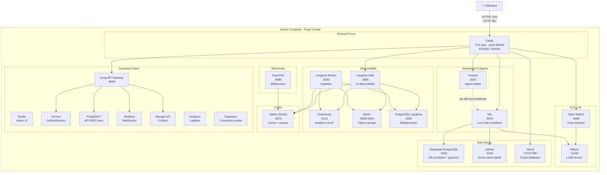
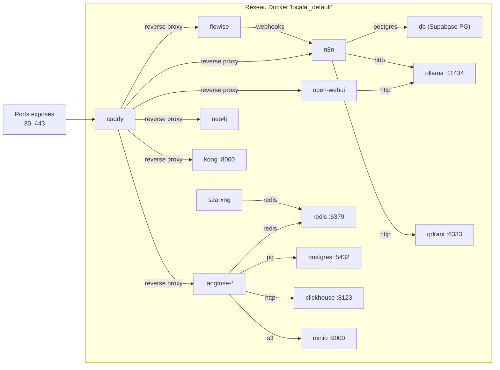
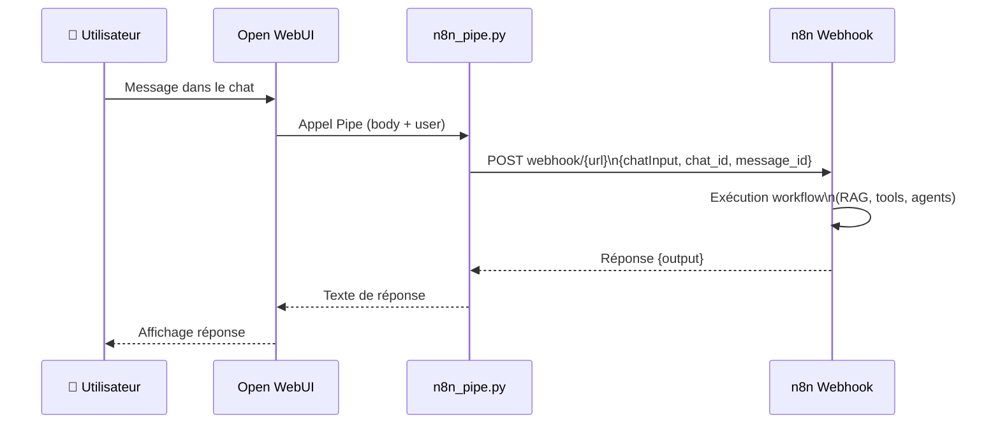
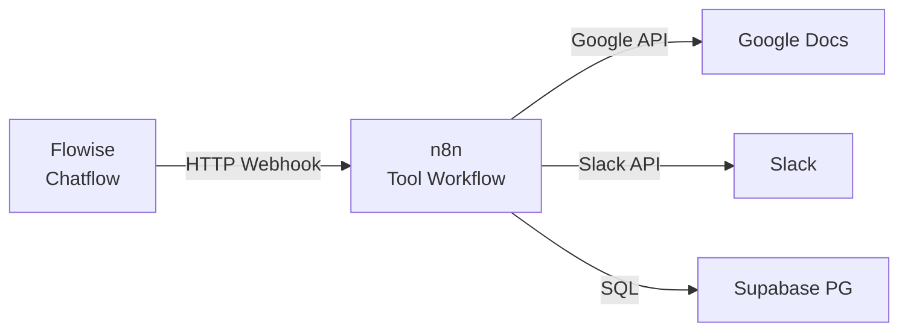
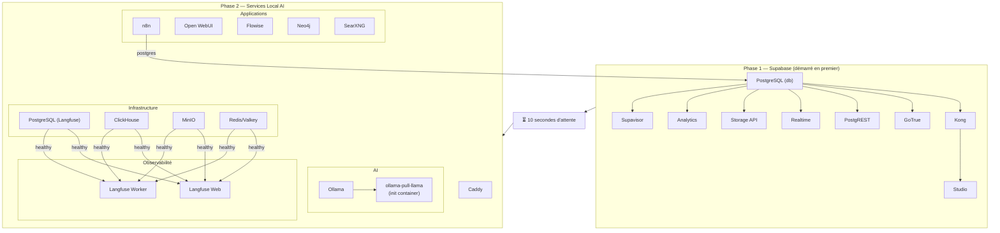
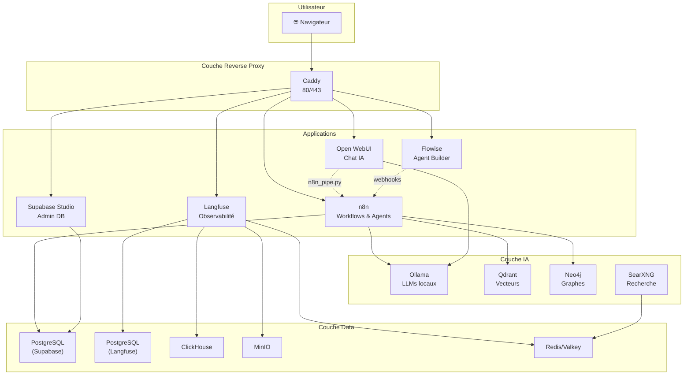

# 🗂️ Dossier Technique — Local AI Packaged

## 1. Vue d'ensemble du projet

### 1.1 Description

**Local AI Packaged** est une plateforme d'IA locale auto-hébergée, packagée sous forme d'un template Docker Compose. Elle fournit un environnement complet de développement low-code, d'orchestration d'agents IA, de RAG (Retrieval Augmented Generation), et d'observabilité — le tout en un seul `docker compose up`.

Le projet est conçu pour fonctionner sur une **machine unique** (poste développeur, serveur dédié, VM cloud) sans dépendance à une infrastructure distribuée. Il regroupe 15+ services interconnectés sous un projet Docker Compose unifié (`localai`).

### 1.2 Origine et crédits

- **Base** : [Self-hosted AI Starter Kit](https://github.com/n8n-io/self-hosted-ai-starter-kit) par n8n.io
- **Maintenu par** : [coleam00](https://github.com/coleam00) — ajout de Supabase, Open WebUI, Flowise, Neo4j, Langfuse, SearXNG, et Caddy
- **Licence** : Apache 2.0

### 1.3 Cas d'usage

| Cas d'usage | Services impliqués |
| :-- | :-- |
| **Chat IA local avec modèles privés** | Open WebUI → Ollama |
| **Agents RAG avec base vectorielle** | n8n → Ollama → Qdrant / Supabase pgvector |
| **Orchestration low-code d'agents** | n8n (workflows) + Flowise (chatflows) |
| **GraphRAG / Knowledge Graphs** | Neo4j + n8n |
| **Recherche web privée** | SearXNG (aucun tracking) |
| **Observabilité LLM** | Langfuse (traces, coûts, latences) |
| **Déploiement production avec TLS** | Caddy + Let's Encrypt |

***

## 2. Architecture

### 2.1 Topologie des services



### 2.2 Projet Docker Compose unifié

Tous les services partagent le nom de projet `localai`, ce qui les regroupe dans Docker Desktop sous une seule entrée. Le projet se compose de :

| Fichier | Rôle |
| :-- | :-- |
| `docker-compose.yml` | Services AI principaux + inclusion Supabase |
| `supabase/docker/docker-compose.yml` | Stack Supabase complète (incluse via `include:`) |
| `docker-compose.override.private.yml` | Expose les ports en `127.0.0.1` (dev local) |
| `docker-compose.override.public.yml` | Ferme les ports non essentiels (production) |
| `docker-compose.override.public.supabase.yml` | Ferme les ports Supabase en production |

### 2.3 Profils Docker Compose

| Profil | Service Ollama | GPU | Usage |
| :-- | :-- | :-- | :-- |
| `cpu` | `ollama-cpu` | Aucun | Fallback CPU |
| `gpu-nvidia` | `ollama-gpu` | NVIDIA (driver natif) | GPU NVIDIA |
| `gpu-amd` | `ollama-gpu-amd` | AMD ROCm (`/dev/kfd`, `/dev/dri`) | GPU AMD (Linux) |
| `none` | Aucun | — | Ollama externe (Mac M1+) |

### 2.4 Environnements de déploiement

| Environnement | Ports exposés | TLS | Cible |
| :-- | :-- | :-- | :-- |
| `private` (défaut) | Tous les ports en `127.0.0.1` | Auto-signé Caddy | Développement local |
| `public` | Uniquement `80` et `443` | Let's Encrypt via Caddy | Production / cloud |

***

## 3. Services — Détail technique

### 3.1 Ollama — LLMs locaux

| Paramètre | Valeur |
| :-- | :-- |
| **Image** | `ollama/ollama:latest` (CPU/NVIDIA), `ollama/ollama:rocm` (AMD) |
| **Port interne** | `11434/tcp` (expose uniquement, pas publié en production) |
| **Volume** | `ollama_storage:/root/.ollama` |
| **Modèles pré-tirés** | `qwen2.5:7b-instruct-q4_K_M`, `nomic-embed-text` |
| **Variables clés** | `OLLAMA_CONTEXT_LENGTH=8192`, `OLLAMA_FLASH_ATTENTION=1`, `OLLAMA_KV_CACHE_TYPE=q8_0`, `OLLAMA_MAX_LOADED_MODELS=2` |

**Init container** : Un conteneur éphémère (`ollama-pull-llama-*`) attend 3 secondes le démarrage d'Ollama puis tire automatiquement les modèles configurés.

### 3.2 Open WebUI — Interface de chat

| Paramètre | Valeur |
| :-- | :-- |
| **Image** | `ghcr.io/open-webui/open-webui:main` |
| **Port interne** | `8080/tcp` |
| **Volume** | `open-webui:/app/backend/data` |
| **Extra hosts** | `host.docker.internal:host-gateway` |
| **Accès Caddy** | Port `:8002` (private) ou domaine dédié (public) |

**Intégration n8n** : Le fichier `n8n_pipe.py` fournit une fonction Pipe Open WebUI permettant d'appeler un webhook n8n comme backend d'agent depuis l'interface de chat.

### 3.3 n8n — Orchestration low-code

| Paramètre | Valeur |
| :-- | :-- |
| **Image** | `n8nio/n8n:latest` |
| **Port interne** | `5678/tcp` |
| **Volumes** | `n8n_storage:/home/node/.n8n`, `./n8n/backup:/backup`, `./shared:/data/shared` |
| **DB** | Supabase PostgreSQL (host: `db`) |
| **Accès Caddy** | Port `:8001` (private) ou domaine dédié (public) |

**Variables d'environnement clés** :

```yaml
DB_TYPE: postgresdb
DB_POSTGRESDB_HOST: db          # Service Supabase PostgreSQL
DB_POSTGRESDB_USER: postgres
DB_POSTGRESDB_PASSWORD: ${POSTGRES_PASSWORD}
DB_POSTGRESDB_DATABASE: postgres
N8N_ENCRYPTION_KEY: ${N8N_ENCRYPTION_KEY}
N8N_USER_MANAGEMENT_JWT_SECRET: ${N8N_USER_MANAGEMENT_JWT_SECRET}
WEBHOOK_URL: https://${N8N_HOSTNAME} ou http://localhost:5678
```

**Workflows pré-inclus** (`n8n/backup/workflows/`) :

| Fichier | Description |
| :-- | :-- |
| `Local_RAG_AI_Agent_n8n_Workflow.json` | Agent RAG basique |
| `V1_Local_RAG_AI_Agent.json` | RAG V1 — Ollama + Qdrant |
| `V2_Local_Supabase_RAG_AI_Agent.json` | RAG V2 — Ollama + Supabase pgvector |
| `V3_Local_Agentic_RAG_AI_Agent.json` | RAG V3 — Agent autonome multi-tool |

### 3.4 Flowise — Agent builder no/low-code

| Paramètre | Valeur |
| :-- | :-- |
| **Image** | `flowiseai/flowise` |
| **Port interne** | `3001/tcp` |
| **Volume** | `~/.flowise:/root/.flowise` |
| **Authentification** | `FLOWISE_USERNAME` / `FLOWISE_PASSWORD` via `.env` |
| **Accès Caddy** | Port `:8003` (private) ou domaine dédié (public) |
| **Extra hosts** | `host.docker.internal:host-gateway` |

**Chatflows et outils pré-inclus** (`flowise/`) :

| Fichier | Type | Description |
| :-- | :-- | :-- |
| `Web Search + n8n Agent Chatflow.json` | Chatflow | Agent combinant recherche web et n8n |
| `create_google_doc-CustomTool.json` | Custom Tool | Création de documents Google via n8n |
| `get_postgres_tables-CustomTool.json` | Custom Tool | Requête tables PostgreSQL via n8n |
| `send_slack_message_through_n8n-CustomTool.json` | Custom Tool | Envoi Slack via n8n |
| `summarize_slack_conversation-CustomTool.json` | Custom Tool | Résumé conversation Slack via n8n |

**Tool Workflows n8n** (`n8n-tool-workflows/`) — Workflows n8n conçus pour être appelés depuis Flowise :

| Fichier | Fonction |
| :-- | :-- |
| `Create_Google_Doc.json` | Crée un document Google Docs |
| `Get_Postgres_Tables.json` | Liste et interroge les tables Supabase |
| `Post_Message_to_Slack.json` | Publie un message Slack |
| `Summarize_Slack_Conversation.json` | Résume une conversation Slack |

### 3.5 Supabase — BaaS complet

La stack Supabase est incluse via la directive `include:` du compose principal et clonée automatiquement par `start_services.py` depuis le dépôt officiel (sparse checkout du dossier `docker/`).

| Composant | Image | Rôle |
| :-- | :-- | :-- |
| **PostgreSQL (db)** | `supabase/postgres` | Base de données principale + pgvector |
| **Kong** | `kong:3.9.1` | API Gateway |
| **GoTrue (auth)** | `supabase/gotrue` | Authentification + JWT |
| **PostgREST (rest)** | `postgrest/postgrest` | API REST auto-générée |
| **Realtime** | `supabase/realtime` | WebSocket + broadcast |
| **Storage API** | `supabase/storage-api` | Stockage fichiers |
| **Studio** | `supabase/studio` | Interface d'administration |
| **Supavisor** | `supabase/supavisor` | Connection pooler |
| **Analytics (Logflare)** | `supabase/logflare` | Logs centralisés |

**Variables d'environnement requises** :

```bash
POSTGRES_PASSWORD=          # Mot de passe PostgreSQL
JWT_SECRET=                 # Secret JWT (min 32 caractères)
ANON_KEY=                   # Clé anonyme Supabase (JWT)
SERVICE_ROLE_KEY=           # Clé service role (JWT)
DASHBOARD_USERNAME=         # Login Studio
DASHBOARD_PASSWORD=         # Mot de passe Studio
POOLER_TENANT_ID=           # ID tenant Supavisor
POOLER_DB_POOL_SIZE=5       # Taille du pool de connexions
```

**Variables requises pour le Storage API (v1.37.8+)** :

```bash
GLOBAL_S3_BUCKET=stub
REGION=stub
STORAGE_TENANT_ID=stub
S3_PROTOCOL_ACCESS_KEY_ID=625729a08b95bf1b7ff351a663f3a23c
S3_PROTOCOL_ACCESS_KEY_SECRET=850181e4652dd023b7a98c58ae0d2d34bd487ee0cc3254aed6eda37307425907
```

### 3.6 Qdrant — Vector store

| Paramètre | Valeur |
| :-- | :-- |
| **Image** | `qdrant/qdrant` |
| **Ports internes** | `6333/tcp` (REST), `6334/tcp` (gRPC) |
| **Volume** | `qdrant_storage:/qdrant/storage` |
| **Accès n8n** | `http://qdrant:6333` |

> Qdrant est conservé en plus de Supabase pgvector car il offre des performances supérieures sur les workloads vectoriels intensifs.

### 3.7 Neo4j — Graph database

| Paramètre | Valeur |
| :-- | :-- |
| **Image** | `neo4j:latest` |
| **Ports internes** | `7473/tcp` (HTTPS), `7474/tcp` (HTTP/Browser), `7687/tcp` (Bolt) |
| **Volumes** | `./neo4j/{logs,config,data,plugins}` (bind mount local) |
| **Authentification** | `NEO4J_AUTH` via `.env` (format `neo4j/password`) |
| **Accès Caddy** | Port `:8008` (private) ou domaine dédié (public) |

**Cas d'usage** : GraphRAG, LightRAG, Graphiti — exploration de relations sémantiques entre entités dans les workflows n8n.

### 3.8 SearXNG — Métamoteur de recherche

| Paramètre | Valeur |
| :-- | :-- |
| **Image** | `searxng/searxng:latest` |
| **Port interne** | `8080/tcp` |
| **Volume** | `./searxng:/etc/searxng:rw` |
| **Cache** | Redis/Valkey (`redis://redis:6379/0`) |
| **Workers** | `SEARXNG_UWSGI_WORKERS=4`, `SEARXNG_UWSGI_THREADS=4` |
| **Secret** | Généré automatiquement par `start_services.py` au premier lancement |

**Sécurité** : SearXNG est configuré avec des capabilities minimales (`cap_drop: ALL`, `cap_add: CHOWN, SETGID, SETUID`) et ne trace ni ne profile les utilisateurs.

### 3.9 Caddy — Reverse proxy TLS

| Paramètre | Valeur |
| :-- | :-- |
| **Image** | `caddy:2-alpine` |
| **Ports publiés** | `80/tcp`, `443/tcp` (seuls ports exposés en production) |
| **Volumes** | `./Caddyfile:/etc/caddy/Caddyfile:ro`, `./caddy-addon:/etc/caddy/addons:ro`, volumes Docker pour data/config |
| **Sécurité** | `cap_drop: ALL`, `cap_add: NET_BIND_SERVICE` |

**Routes par défaut** (mode private, via ports Caddy) :

| Service | Port Caddy | Backend |
| :-- | :-- | :-- |
| n8n | `:8001` | `n8n:5678` |
| Open WebUI | `:8002` | `open-webui:8080` |
| Flowise | `:8003` | `flowise:3001` |
| Ollama API | `:8004` | `ollama:11434` (commenté par défaut) |
| Supabase | `:8005` | `kong:8000` |
| SearXNG | `:8006` | `searxng:8080` (commenté par défaut) |
| Langfuse | `:8007` | `langfuse-web:3000` |
| Neo4j | `:8008` | `neo4j:7474` |

**Mode production** : Les variables `*_HOSTNAME` remplacent les ports par des domaines, et Caddy obtient automatiquement des certificats Let's Encrypt.

**Addons** : Le dossier `caddy-addon/` est importé via `import /etc/caddy/addons/*.conf`, permettant d'ajouter des configurations Caddy supplémentaires sans modifier le Caddyfile principal.

### 3.10 Langfuse — Observabilité LLM

Langfuse fournit le suivi des traces, coûts et latences des appels LLM dans les workflows n8n et Flowise.

| Composant | Image | Rôle |
| :-- | :-- | :-- |
| **langfuse-web** | `langfuse/langfuse:3` | Interface web + API |
| **langfuse-worker** | `langfuse/langfuse-worker:3` | Ingestion asynchrone |
| **clickhouse** | `clickhouse/clickhouse-server` | Stockage analytique OLAP |
| **minio** | `minio/minio` | Object storage (événements, médias, exports) |
| **postgres** | `postgres:17` | Métadonnées Langfuse |
| **redis** | `valkey/valkey:8-alpine` | Cache et queues |

**Dépendances au démarrage** : `langfuse-web` et `langfuse-worker` attendent que `postgres`, `minio`, `redis` et `clickhouse` soient healthy avant de démarrer.

**Variables d'environnement requises** :

```bash
CLICKHOUSE_PASSWORD=        # Mot de passe ClickHouse
MINIO_ROOT_PASSWORD=        # Mot de passe admin MinIO
LANGFUSE_SALT=              # Salt de chiffrement Langfuse
NEXTAUTH_SECRET=            # Secret NextAuth.js
ENCRYPTION_KEY=             # Clé de chiffrement Langfuse
```

### 3.11 Redis — Cache et queues

| Paramètre | Valeur |
| :-- | :-- |
| **Image** | `valkey/valkey:8-alpine` |
| **Port interne** | `6379/tcp` |
| **Volume** | `valkey-data:/data` |
| **Persistence** | `save 30 1` (snapshot toutes les 30s si au moins 1 write) |
| **Sécurité** | `cap_drop: ALL`, `cap_add: SETGID, SETUID, DAC_OVERRIDE` |
| **Utilisé par** | SearXNG (cache recherche), Langfuse (queues ingestion) |

***

## 4. Réseau Docker

### 4.1 Topologie réseau interne

Tous les services partagent le réseau Docker par défaut du projet `localai`. Les services communiquent entre eux par nom de service DNS Docker.



### 4.2 Résolution DNS inter-services

| Depuis | Vers | Nom DNS | Port |
| :-- | :-- | :-- | :-- |
| n8n | Supabase PostgreSQL | `db` | `5432` |
| n8n | Ollama | `ollama` | `11434` |
| n8n | Qdrant | `qdrant` | `6333` |
| Open WebUI | Ollama | `ollama` | `11434` |
| SearXNG | Redis | `redis` | `6379` |
| Langfuse | PostgreSQL (dédié) | `postgres` | `5432` |
| Langfuse | ClickHouse | `clickhouse` | `8123` |
| Langfuse | MinIO | `minio` | `9000` |
| Langfuse | Redis | `redis` | `6379` |
| Caddy | Kong (Supabase) | `kong` | `8000` |

### 4.3 Ports exposés — Mode privé (dev local)

Tous les ports sont bindés sur `127.0.0.1` pour empêcher l'accès réseau externe :

| Service | Port hôte | Port conteneur |
| :-- | :-- | :-- |
| Caddy (HTTP) | `80` | `80` |
| Caddy (HTTPS) | `443` | `443` |
| n8n | `127.0.0.1:5678` | `5678` |
| Open WebUI | `127.0.0.1:8080` | `8080` |
| Flowise | `127.0.0.1:3001` | `3001` |
| Ollama | `127.0.0.1:11434` | `11434` |
| Qdrant REST | `127.0.0.1:6333` | `6333` |
| Qdrant gRPC | `127.0.0.1:6334` | `6334` |
| Neo4j HTTPS | `127.0.0.1:7473` | `7473` |
| Neo4j HTTP | `127.0.0.1:7474` | `7474` |
| Neo4j Bolt | `127.0.0.1:7687` | `7687` |
| Langfuse Web | `127.0.0.1:3000` | `3000` |
| Langfuse Worker | `127.0.0.1:3030` | `3030` |
| ClickHouse HTTP | `127.0.0.1:8123` | `8123` |
| MinIO API | `127.0.0.1:9010` | `9000` |
| MinIO Console | `127.0.0.1:9011` | `9001` |
| PostgreSQL (Langfuse) | `127.0.0.1:5433` | `5432` |
| Redis | `127.0.0.1:6379` | `6379` |
| SearXNG | `127.0.0.1:8081` | `8080` |

### 4.4 Ports exposés — Mode public (production)

| Service | Ports ouverts |
| :-- | :-- |
| Caddy | `80`, `443` |
| Supabase Analytics | Fermé (`!reset null`) |
| Supabase Kong | Fermé (`!reset null`) |
| Supabase Supavisor | Fermé (`!reset null`) |
| Tous les autres | Fermé (uniquement `expose`, pas de `ports`) |

> En mode public, tous les accès passent par Caddy via HTTPS. Aucun service n'est directement accessible depuis l'extérieur.

***

## 5. Script de démarrage — `start_services.py`

### 5.1 Séquence de démarrage

```mermaid
sequenceDiagram
    participant User as 👤 Utilisateur
    participant Script as start_services.py
    participant Git as Git (Supabase repo)
    participant Docker as Docker Compose
    participant Supabase as Supabase Stack
    participant LocalAI as Local AI Stack

    User->>Script: python start_services.py --profile gpu-nvidia

    rect rgb(50, 60, 80)
    Note over Script,Git: Phase 1 — Clone Supabase
    Script->>Git: git clone --sparse supabase/docker
    Git-->>Script: Sparse checkout OK
    end

    rect rgb(50, 70, 50)
    Note over Script: Phase 2 — Préparation
    Script->>Script: Copie .env → supabase/docker/.env
    Script->>Script: Fix CRLF Windows (pooler.exs)
    Script->>Script: Génère SearXNG secret key
    end

    rect rgb(60, 50, 50)
    Note over Script,Supabase: Phase 3 — Démarrage Supabase
    Script->>Docker: docker compose -p localai -f supabase/docker/docker-compose.yml up -d
    Docker->>Supabase: Démarrage PostgreSQL, Kong, Auth, Studio...
    Script->>Script: sleep(10) — attente initialisation
    end

    rect rgb(50, 50, 70)
    Note over Script,LocalAI: Phase 4 — Démarrage Local AI
    Script->>Docker: docker compose -p localai --profile gpu-nvidia -f docker-compose.yml [-f override] up -d
    Docker->>LocalAI: Démarrage n8n, Ollama, Open WebUI, Flowise, Qdrant, Neo4j, Caddy...
    end

    Script-->>User: ✅ Stack opérationnelle
```



### 5.2 Arguments CLI

```
python start_services.py --profile <profile> [--environment <env>]

--profile    : cpu | gpu-nvidia | gpu-amd | none (obligatoire)
--environment: private (défaut) | public
```

### 5.3 Opérations automatiques

| Étape | Action |
| :-- | :-- |
| **Clone Supabase** | Sparse checkout du dossier `docker/` depuis GitHub (ou `git pull` si déjà cloné) |
| **Copie .env** | Le `.env` racine est copié vers `supabase/docker/.env` pour partager les variables |
| **Fix Windows** | Conversion CRLF → LF dans `pooler.exs` (évite un crash Supavisor sur Windows) |
| **SearXNG secret** | Génération d'un secret aléatoire de 32 octets et remplacement dans `searxng/settings.yml` |
| **SearXNG first run** | Détection de première exécution pour gérer les volumes SearXNG correctement |
| **Démarrage séquentiel** | Supabase démarre en premier, puis 10s d'attente, puis les services AI |

***

## 6. Volumes Docker

### 6.1 Volumes nommés

| Volume | Service | Contenu |
| :-- | :-- | :-- |
| `n8n_storage` | n8n | Workflows, credentials, settings |
| `ollama_storage` | Ollama | Modèles LLM téléchargés |
| `qdrant_storage` | Qdrant | Collections vectorielles |
| `open-webui` | Open WebUI | Données utilisateur, historique chat |
| `flowise` | Flowise | — (volume déclaré, données dans bind mount `~/.flowise`) |
| `caddy-data` | Caddy | Certificats TLS, état ACME |
| `caddy-config` | Caddy | Configuration runtime Caddy |
| `valkey-data` | Redis/Valkey | Données persistées (snapshots) |
| `langfuse_postgres_data` | PostgreSQL (Langfuse) | Données relationnelles Langfuse |
| `langfuse_clickhouse_data` | ClickHouse | Données analytiques |
| `langfuse_clickhouse_logs` | ClickHouse | Logs du serveur |
| `langfuse_minio_data` | MinIO | Événements, médias, exports |

### 6.2 Bind mounts

| Chemin hôte | Conteneur | Montage | Usage |
| :-- | :-- | :-- | :-- |
| `./Caddyfile` | Caddy | `:ro` | Configuration du reverse proxy |
| `./caddy-addon/` | Caddy | `:ro` | Configurations Caddy additionnelles |
| `./searxng/` | SearXNG | `:rw` | Configuration et settings SearXNG |
| `./n8n/backup/` | n8n | `:rw` | Répertoire de backup workflows |
| `./shared/` | n8n | `:rw` | Dossier partagé (`/data/shared` dans le conteneur) |
| `./neo4j/{logs,config,data,plugins}` | Neo4j | `:rw` | Données et configuration Neo4j |
| `~/.flowise/` | Flowise | `:rw` | Données persistantes Flowise |

***

## 7. Sécurité

### 7.1 Posture de sécurité par environnement

| Aspect | Private (dev) | Public (production) |
| :-- | :-- | :-- |
| **Ports exposés** | Tous en `127.0.0.1` | `80` et `443` uniquement |
| **TLS** | Auto-signé Caddy (ports numériques) | Let's Encrypt automatique |
| **Accès admin Supabase** | Via port direct | Via Caddy uniquement |
| **Supabase Kong** | Port exposé | Fermé (`!reset null`) |
| **Supabase Analytics** | Port exposé | Fermé (`!reset null`) |
| **Supabase Supavisor** | Port exposé | Fermé (`!reset null`) |

### 7.2 Hardening des conteneurs

| Service | `cap_drop` | `cap_add` | Justification |
| :-- | :-- | :-- | :-- |
| Caddy | `ALL` | `NET_BIND_SERVICE` | Bind ports 80/443 uniquement |
| Redis/Valkey | `ALL` | `SETGID`, `SETUID`, `DAC_OVERRIDE` | Minimum pour le daemon Valkey |
| SearXNG | `ALL` | `CHOWN`, `SETGID`, `SETUID` | Minimum pour uWSGI |

### 7.3 Logging contrôlé

Les services Caddy, Redis et SearXNG utilisent un driver de log JSON limité :

```yaml
logging:
  driver: "json-file"
  options:
    max-size: "1m"
    max-file: "1"
```

Cela empêche l'accumulation de logs sur disque en environnement non supervisé.

### 7.4 Secrets requis

> ⚠️ **Ne jamais utiliser les valeurs d'exemple en production.** Tous les secrets doivent être des valeurs aléatoires fortes.

| Secret | Service | Génération recommandée |
| :-- | :-- | :-- |
| `N8N_ENCRYPTION_KEY` | n8n | `openssl rand -hex 32` |
| `N8N_USER_MANAGEMENT_JWT_SECRET` | n8n | `openssl rand -hex 32` |
| `POSTGRES_PASSWORD` | Supabase PostgreSQL | `openssl rand -base64 32` |
| `JWT_SECRET` | Supabase Auth | Min 32 caractères, `openssl rand -hex 32` |
| `ANON_KEY` | Supabase | JWT signé avec `JWT_SECRET` (rôle `anon`) |
| `SERVICE_ROLE_KEY` | Supabase | JWT signé avec `JWT_SECRET` (rôle `service_role`) |
| `DASHBOARD_USERNAME` | Supabase Studio | Choix utilisateur |
| `DASHBOARD_PASSWORD` | Supabase Studio | Mot de passe fort |
| `NEO4J_AUTH` | Neo4j | Format `neo4j/<password>` |
| `CLICKHOUSE_PASSWORD` | ClickHouse | `openssl rand -hex 16` |
| `MINIO_ROOT_PASSWORD` | MinIO | `openssl rand -hex 16` |
| `LANGFUSE_SALT` | Langfuse | `openssl rand -hex 16` |
| `NEXTAUTH_SECRET` | Langfuse | `openssl rand -hex 32` |
| `ENCRYPTION_KEY` | Langfuse | `openssl rand -hex 32` |
| `FLOWISE_USERNAME` | Flowise | Choix utilisateur |
| `FLOWISE_PASSWORD` | Flowise | Mot de passe fort |

***

## 8. Configuration Caddy — Détail

### 8.1 Structure du Caddyfile

```caddyfile
{
    email {$LETSENCRYPT_EMAIL}         # Email Let's Encrypt (production)
}

# ── Services principaux ───────────────────────────────────
{$N8N_HOSTNAME}        { reverse_proxy n8n:5678 }
{$WEBUI_HOSTNAME}      { reverse_proxy open-webui:8080 }
{$FLOWISE_HOSTNAME}    { reverse_proxy flowise:3001 }
{$LANGFUSE_HOSTNAME}   { reverse_proxy langfuse-web:3000 }
{$SUPABASE_HOSTNAME}   { reverse_proxy kong:8000 }
{$NEO4J_HOSTNAME}      { reverse_proxy neo4j:7474 }

# ── Addons ────────────────────────────────────────────────
import /etc/caddy/addons/*.conf       # Extensions personnalisées

# ── Commentés par défaut ──────────────────────────────────
# {$OLLAMA_HOSTNAME}   { reverse_proxy ollama:11434 }
# {$SEARXNG_HOSTNAME}  { ... config SearXNG avec headers sécurité ... }
```

### 8.2 Variables d'environnement Caddy

| Variable | Défaut (private) | Production (public) |
| :-- | :-- | :-- |
| `N8N_HOSTNAME` | `:8001` | `n8n.yourdomain.com` |
| `WEBUI_HOSTNAME` | `:8002` | `openwebui.yourdomain.com` |
| `FLOWISE_HOSTNAME` | `:8003` | `flowise.yourdomain.com` |
| `OLLAMA_HOSTNAME` | `:8004` | `ollama.yourdomain.com` |
| `SUPABASE_HOSTNAME` | `:8005` | `supabase.yourdomain.com` |
| `SEARXNG_HOSTNAME` | `:8006` | `searxng.yourdomain.com` |
| `LANGFUSE_HOSTNAME` | `:8007` | `langfuse.yourdomain.com` |
| `NEO4J_HOSTNAME` | `:8008` | `neo4j.yourdomain.com` |
| `LETSENCRYPT_EMAIL` | `internal` | `your-email@domain.com` |

> En mode private (port numérique comme `:8001`), Caddy n'active pas HTTPS — les services sont accessibles en HTTP. En mode public (FQDN), Caddy obtient automatiquement un certificat Let's Encrypt et force HTTPS.

### 8.3 Extension SearXNG (commentée par défaut)

Le Caddyfile inclut une configuration SearXNG complète commentée, avec :

- **Content-Security-Policy** restrictive
- **Permissions-Policy** désactivant caméra, géolocalisation, microphone, etc.
- **Referrer-Policy** : `no-referrer`
- **HSTS** : `max-age=31536000`
- **Cache différencié** : pas de cache par défaut, 5s pour `/search`, 7 jours pour `/image_proxy`, immutable pour `/static/*`
- **CORS** sur `/config`, `/healthz`, `/stats/*`
- **Suppression du header `Server`**

***

## 9. Intégration Open WebUI ↔ n8n

### 9.1 Pipe n8n (`n8n_pipe.py`)

Le fichier `n8n_pipe.py` implémente une fonction Pipe Open WebUI qui route les messages de chat vers un webhook n8n, permettant d'utiliser des workflows n8n comme backend d'agent dans l'interface de chat.



**Configuration dans Open WebUI** :

1. `Workspace → Functions → Add Function`
2. Coller le code de `n8n_pipe.py`
3. Configurer les Valves :
   - `n8n_url` : URL du webhook n8n (production)
   - `n8n_bearer_token` : Token d'authentification
   - `input_field` : `chatInput` (défaut)
   - `response_field` : `output` (défaut)

### 9.2 Intégration Flowise ↔ n8n

Flowise appelle n8n via des **Tool Workflows** — des workflows n8n exposés comme webhooks et consommés comme outils custom dans les chatflows Flowise :



***

## 10. Données et workflows pré-inclus

### 10.1 Workflows n8n RAG pré-configurés

| Version | Fichier | Composants | Description |
| :-- | :-- | :-- | :-- |
| Base | `Local_RAG_AI_Agent_n8n_Workflow.json` | Ollama + Qdrant | Agent RAG basique |
| V1 | `V1_Local_RAG_AI_Agent.json` | Ollama + Qdrant | RAG avec chunking |
| V2 | `V2_Local_Supabase_RAG_AI_Agent.json` | Ollama + Supabase pgvector | RAG via Supabase |
| V3 | `V3_Local_Agentic_RAG_AI_Agent.json` | Ollama + multi-tool | Agent RAG autonome |

### 10.2 Credentials à créer après import

| Service | URL dans Docker | Notes |
| :-- | :-- | :-- |
| **Ollama** | `http://ollama:11434` | Pas de clé API nécessaire |
| **PostgreSQL (Supabase)** | Host: `db`, Port: `5432` | User/password depuis `.env` |
| **Qdrant** | `http://qdrant:6333` | Clé API arbitraire (local) |
| **Google Drive** | OAuth2 | Voir [guide n8n](https://docs.n8n.io/integrations/builtin/credentials/google/) |

***

## 11. Commandes opérationnelles

### 11.1 Gestion du cycle de vie

```bash
# ── Démarrage ─────────────────────────────────────
# GPU NVIDIA
python start_services.py --profile gpu-nvidia

# GPU AMD (Linux uniquement)
python start_services.py --profile gpu-amd

# CPU uniquement
python start_services.py --profile cpu

# Sans Ollama (Ollama local sur Mac)
python start_services.py --profile none

# Production (ferme les ports non essentiels)
python start_services.py --profile gpu-nvidia --environment public

# ── Arrêt ─────────────────────────────────────────
docker compose -p localai -f docker-compose.yml --profile <profile> down

# ── Mise à jour ───────────────────────────────────
docker compose -p localai -f docker-compose.yml --profile <profile> down
docker compose -p localai -f docker-compose.yml --profile <profile> pull
python start_services.py --profile <profile>
```

### 11.2 Accès aux services (mode private)

| Service | URL |
| :-- | :-- |
| n8n | http://localhost:5678 ou http://localhost:8001 (Caddy) |
| Open WebUI | http://localhost:8080 ou http://localhost:8002 (Caddy) |
| Flowise | http://localhost:3001 ou http://localhost:8003 (Caddy) |
| Supabase Studio | http://localhost:8005 (Caddy) |
| Langfuse | http://localhost:3000 ou http://localhost:8007 (Caddy) |
| SearXNG | http://localhost:8081 |
| Neo4j Browser | http://localhost:7474 ou http://localhost:8008 (Caddy) |
| Qdrant Dashboard | http://localhost:6333/dashboard |
| MinIO Console | http://localhost:9011 |

### 11.3 Diagnostic et debug

```bash
# ── Logs ──────────────────────────────────────────
docker compose -p localai logs -f n8n
docker compose -p localai logs -f ollama
docker compose -p localai logs -f open-webui
docker compose -p localai logs -f langfuse-web

# ── État des conteneurs ──────────────────────────
docker compose -p localai ps

# ── Vérification santé Ollama ────────────────────
docker exec ollama ollama list
docker exec ollama ollama ps        # Modèles chargés en mémoire

# ── Validation compose ───────────────────────────
docker compose -p localai -f docker-compose.yml --profile gpu-nvidia config

# ── Recréer un service spécifique ────────────────
docker compose -p localai up -d --force-recreate n8n
```

***

## 12. Health checks intégrés

Les services suivants disposent de health checks Docker natifs :

| Service | Commande de health check | Intervalle | Retries |
| :-- | :-- | :-- | :-- |
| PostgreSQL (Langfuse) | `pg_isready -U postgres` | 3s | 10 |
| ClickHouse | `wget --spider http://localhost:8123/ping` | 5s | 10 |
| MinIO | `mc ready local` | 1s | 5 |
| Redis/Valkey | `redis-cli ping` | 3s | 10 |
| Supabase PostgreSQL | `pg_isready` | Voir compose Supabase | — |
| Supabase Kong | Health check intégré | Voir compose Supabase | — |

> Les services Langfuse (`langfuse-web`, `langfuse-worker`) utilisent `depends_on` avec `condition: service_healthy` pour un ordonnancement de démarrage garanti.

***

## 13. Prérequis système

### 13.1 Logiciels requis

| Logiciel | Version min. | Usage |
| :-- | :-- | :-- |
| **Python** | 3.8+ | Script `start_services.py` |
| **Git** | 2.25+ | Clone sparse checkout Supabase |
| **Docker** | 24.0+ | Exécution des conteneurs |
| **Docker Compose** | v2.20+ | Orchestration (plugin `compose`) |
| **NVIDIA Container Toolkit** | — | GPU NVIDIA uniquement |

### 13.2 Ressources recommandées

| Profil | RAM min. | Disque | GPU | Notes |
| :-- | :-- | :-- | :-- | :-- |
| **Développement (cpu)** | 16 GB | 50 GB | — | Modèles petits (< 4B) |
| **Standard (gpu-nvidia)** | 32 GB | 100 GB | 8+ GB VRAM | Modèles 7B |
| **Production** | 64 GB | 200 GB | 24+ GB VRAM | Modèles 13B+ |

### 13.3 Ports requis

| Port | Service | Obligatoire |
| :-- | :-- | :-- |
| `80` | Caddy HTTP | Oui (redirect HTTPS en prod) |
| `443` | Caddy HTTPS | Oui (production TLS) |
| `5678` | n8n (dev) | Non — via Caddy en prod |
| `8080` | Open WebUI (dev) | Non — via Caddy en prod |

***

## 14. Incompatibilités et limites connues

| Limitation | Détail | Contournement |
| :-- | :-- | :-- |
| **Mac — pas de GPU Docker** | Apple Silicon ne peut pas exposer le GPU à Docker | Profil `none` + Ollama local |
| **Windows — CRLF pooler.exs** | Le pooler Supavisor crashe avec des fins de ligne Windows | Corrigé automatiquement par `start_services.py` |
| **AMD GPU — Linux only** | ROCm nécessite `/dev/kfd` et `/dev/dri`, disponibles uniquement sous Linux | Pas de support Windows/Mac |
| **Flowise volume** | Volume Docker déclaré mais données réellement dans `~/.flowise` (bind mount) | Cohérence à vérifier si migration |
| **SearXNG premier lancement** | Nécessite une gestion spéciale des volumes à la première exécution | Géré par `start_services.py` |
| **ufw + Docker** | Docker bypass les règles ufw — les ports Docker ne sont pas protégés par ufw | Utiliser le mode `public` qui ne publie que 80/443 |
| **Supabase Storage v1.37.8+** | Variables `REGION`, `GLOBAL_S3_BUCKET`, etc. requises | Valeurs `stub` fonctionnent pour le stockage local |

***

## 15. Diagramme de dépendances au démarrage



***

## 16. Arborescence du projet

```
local-ai-packaged/
├── .env.example                     ← Template des variables d'environnement
├── .env                             ← Variables d'environnement (à créer)
├── docker-compose.yml               ← Services principaux + include Supabase
├── docker-compose.override.private.yml  ← Ports 127.0.0.1 (dev)
├── docker-compose.override.public.yml   ← Fermeture des ports (prod)
├── docker-compose.override.public.supabase.yml  ← Fermeture ports Supabase (prod)
├── Caddyfile                        ← Configuration reverse proxy
├── start_services.py                ← Script de démarrage orchestré
├── n8n_pipe.py                      ← Pipe Open WebUI → n8n
├── README.md                        ← Documentation utilisateur
│
├── caddy-addon/                     ← Configurations Caddy additionnelles
│   └── .gitkeep
│
├── flowise/                         ← Chatflows et outils Flowise pré-configurés
│   ├── Web Search + n8n Agent Chatflow.json
│   ├── create_google_doc-CustomTool.json
│   ├── get_postgres_tables-CustomTool.json
│   ├── send_slack_message_through_n8n-CustomTool.json
│   └── summarize_slack_conversation-CustomTool.json
│
├── n8n/
│   └── backup/
│       └── workflows/               ← Workflows n8n pré-configurés
│           ├── Local_RAG_AI_Agent_n8n_Workflow.json
│           ├── V1_Local_RAG_AI_Agent.json
│           ├── V2_Local_Supabase_RAG_AI_Agent.json
│           └── V3_Local_Agentic_RAG_AI_Agent.json
│
├── n8n-tool-workflows/              ← Workflows n8n utilisables comme tools Flowise
│   ├── Create_Google_Doc.json
│   ├── Get_Postgres_Tables.json
│   ├── Post_Message_to_Slack.json
│   └── Summarize_Slack_Conversation.json
│
├── neo4j/                           ← Données et config Neo4j (bind mount)
│   ├── config/
│   ├── data/
│   ├── logs/
│   └── plugins/
│
├── scripts/
│   └── openwebui_admin_recovery.py  ← Script de récupération admin Open WebUI
│
├── searxng/                         ← Configuration SearXNG
│   ├── settings-base.yml            ← Template de base
│   └── settings.yml                 ← Settings actifs (secret auto-généré)
│
├── shared/                          ← Dossier partagé (monté dans n8n → /data/shared)
│
├── pipelines-data/                  ← Données des pipelines Open WebUI
│
└── supabase/                        ← Répertoire Supabase (sparse checkout, cloné au runtime)
    └── docker/
        ├── docker-compose.yml       ← Stack Supabase complète
        ├── .env                     ← Copié depuis .env racine par start_services.py
        └── volumes/                 ← Données Supabase
            ├── api/
            ├── db/
            ├── functions/
            ├── logs/
            ├── pooler/
            ├── proxy/
            ├── snippets/
            └── storage/
```

***

## 17. YAML Anchors et templates réutilisables

Le `docker-compose.yml` utilise des YAML anchors pour éviter la duplication de configuration entre les variantes Ollama :

### `x-n8n` — Template service n8n

```yaml
x-n8n: &service-n8n
  image: n8nio/n8n:latest
  environment:
    - DB_TYPE=postgresdb
    - DB_POSTGRESDB_HOST=db
    - DB_POSTGRESDB_PASSWORD=${POSTGRES_PASSWORD}
    # ... autres variables
```

### `x-ollama` — Template service Ollama

```yaml
x-ollama: &service-ollama
  image: ollama/ollama:latest
  container_name: ollama
  restart: unless-stopped
  expose:
    - 11434/tcp
  environment:
    - OLLAMA_CONTEXT_LENGTH=8192
    - OLLAMA_FLASH_ATTENTION=1
    - OLLAMA_KV_CACHE_TYPE=q8_0
    - OLLAMA_MAX_LOADED_MODELS=2
  volumes:
    - ollama_storage:/root/.ollama
```

Décliné en 3 variantes via profils :

| Service | Profil | Spécificité |
| :-- | :-- | :-- |
| `ollama-cpu` | `cpu` | Base `*service-ollama` sans GPU |
| `ollama-gpu` | `gpu-nvidia` | + `deploy.resources.reservations.devices` NVIDIA |
| `ollama-gpu-amd` | `gpu-amd` | + image `rocm`, + devices `/dev/kfd`, `/dev/dri` |

### `x-init-ollama` — Template init container Ollama

```yaml
x-init-ollama: &init-ollama
  image: ollama/ollama:latest
  container_name: ollama-pull-llama
  volumes:
    - ollama_storage:/root/.ollama
  entrypoint: /bin/sh
  command:
    - "-c"
    - "sleep 3; OLLAMA_HOST=ollama:11434 ollama pull qwen2.5:7b-instruct-q4_K_M; OLLAMA_HOST=ollama:11434 ollama pull nomic-embed-text"
```

Décliné en 3 variantes avec `depends_on` vers le service Ollama correspondant.

***

## 18. Déploiement cloud — Étapes supplémentaires

### 18.1 Prérequis

- Machine Linux (Ubuntu recommandé) avec Git, Docker et Docker Compose V2
- Enregistrement DNS : A records pointant chaque sous-domaine vers l'IP cloud

### 18.2 Configuration firewall hôte

```bash
ufw enable
ufw allow 80 && ufw allow 443
ufw reload
```

> ⚠️ **Attention** : `ufw` ne protège pas les ports publiés par Docker (iptables Docker prennent priorité). Le mode `public` est la vraie protection — il ne publie que les ports 80 et 443.

### 18.3 Configuration `.env` pour la production

```bash
# Caddy — domaines personnalisés
N8N_HOSTNAME=n8n.yourdomain.com
WEBUI_HOSTNAME=openwebui.yourdomain.com
FLOWISE_HOSTNAME=flowise.yourdomain.com
SUPABASE_HOSTNAME=supabase.yourdomain.com
LANGFUSE_HOSTNAME=langfuse.yourdomain.com
NEO4J_HOSTNAME=neo4j.yourdomain.com
LETSENCRYPT_EMAIL=your-email@domain.com
```

### 18.4 Lancement en production

```bash
python3 start_services.py --profile gpu-nvidia --environment public
```

***

## 19. Utilitaires et scripts

### 19.1 `scripts/openwebui_admin_recovery.py`

Script de récupération du compte administrateur Open WebUI en cas de perte d'accès.

### 19.2 `n8n_pipe.py`

Fonction Pipe Open WebUI pour l'intégration avec les webhooks n8n. Configurable via les Valves (URL webhook, token bearer, champs I/O, indicateurs de status).

***

## 20. Résumé des interconnexions


